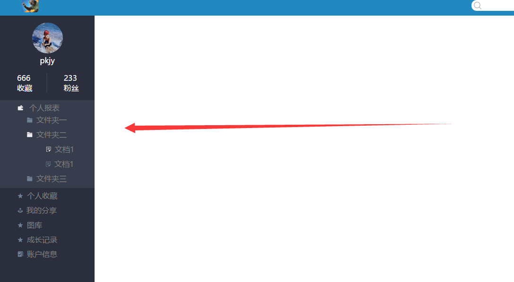
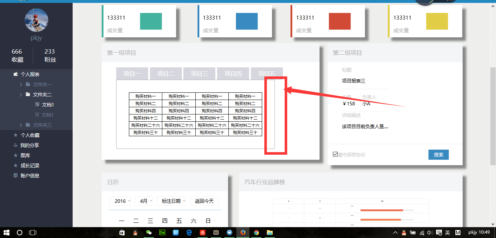
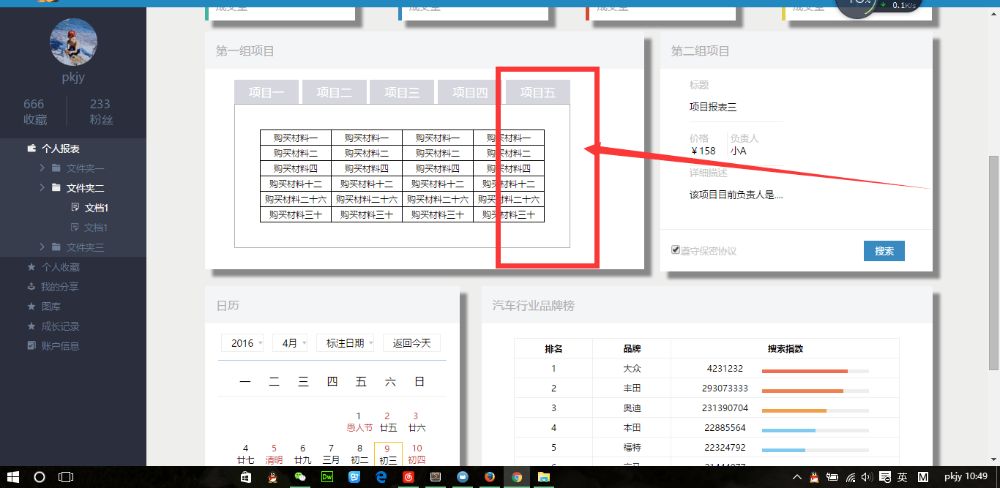
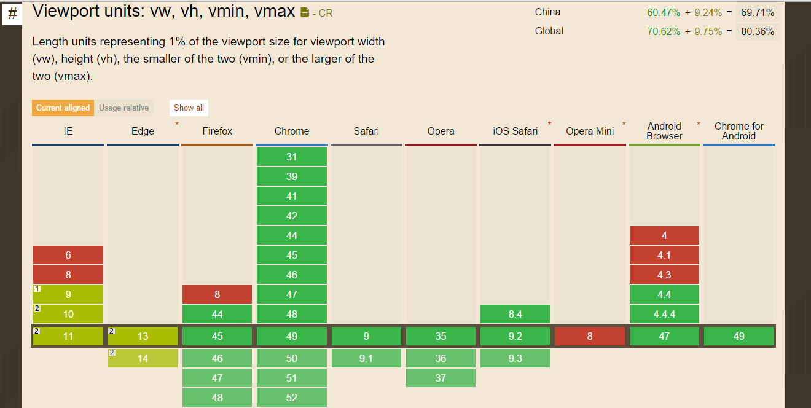

# 2016年百度IFE春季班

## Demo 
task01 任务要求地址：<https://github.com/pkjy/ife-task/blob/gh-pages/2016_spring/part1/task01.md> 
task01 在线预览地址：<http://pkjy.github.io/ife-task/2016_spring/part1/task01.html>

task02 任务要求地址：<https://github.com/pkjy/ife-task/blob/gh-pages/2016_spring/part1/task02.md> 
task02 在线预览地址：<http://pkjy.github.io/ife-task/2016_spring/part1/task02.html>

task03 任务要求地址：<https://github.com/pkjy/ife-task/blob/gh-pages/2016_spring/part1/task03.md> 
task03 在线预览地址：<http://pkjy.github.io/ife-task/2016_spring/part1/task03.html>

task04 任务要求地址：<https://github.com/pkjy/ife-task/blob/gh-pages/2016_spring/part1/task04.md> 
task04 在线预览地址：<http://pkjy.github.io/ife-task/2016_spring/part1/task04.html>

task05 任务要求地址：<https://github.com/pkjy/ife-task/blob/gh-pages/2016_spring/part1/task05.md> 
task05 在线预览地址：<http://pkjy.github.io/ife-task/2016_spring/part1/task05.html>

task07 任务要求地址：<https://github.com/pkjy/ife-task/blob/gh-pages/2016_spring/part1/task07.md> 
task07 在线预览地址：<http://pkjy.github.io/ife-task/2016_spring/part1/task07.html>

task08 任务要求地址：<https://github.com/pkjy/ife-task/blob/gh-pages/2016_spring/part1/task08.md> 
task08 在线预览地址：<http://pkjy.github.io/ife-task/2016_spring/part1/task08.html>

task09 任务要求地址：<https://github.com/pkjy/ife-task/blob/gh-pages/2016_spring/part1/task09.md> 
task09 在线预览地址：<http://pkjy.github.io/ife-task/2016_spring/part1/task09.html>

task10 任务要求地址：<https://github.com/pkjy/ife-task/blob/gh-pages/2016_spring/part1/task10.md> 
task10 在线预览地址：<http://pkjy.github.io/ife-task/2016_spring/part1/task10.html>

task11 任务要求地址：<https://github.com/pkjy/ife-task/blob/gh-pages/2016_spring/part1/task11.md> 
task11 在线预览地址：<http://pkjy.github.io/ife-task/2016_spring/part1/task11.html>

task12 任务要求地址：<https://github.com/pkjy/ife-task/blob/gh-pages/2016_spring/part1/task12.md> 
task12 在线预览地址：<http://pkjy.github.io/ife-task/2016_spring/part1/task12.html>

## IFE春季班第一阶段任务

　　第一阶段的主要目标是帮助大家 **了解、认识、学习、掌握HTML及CSS**。第一阶段任务从 **3月14日** 开始，持续到 **4月3日**。当然，您也可以在这个时间以后继续自行实践练习。

　　第一阶段任务一共有 **12** 个题目，如下：

　　**任务一**：面向零基础的HTML代码编写

　　**任务二**：基于任务1的HTML代码，实现简单的CSS代码编写

　　**任务三**：HTML、CSS布局入门，三栏式布局的实践

　　**任务四**：HTML、CSS布局深入，定位和居中问题的实践

　　**任务五**：基于任务1的HTML代码，实现一个稍微复杂的CSS代码编写

　　**任务六**：按照设计图，通过HTML/CSS实现一个像报纸杂志一样的页面布局排版

　　**任务七**：按照设计图，通过HTML/CSS实现一个产品官网

　　**任务八**：网格/栅格化布局学习与实践

　　**任务九**：按照设计图，通过HTML/CSS实现一个复杂的业务系统页面

　　**任务十**：学习和练习Flex布局

　　**任务十一**：移动Web开发入门，按照设计稿实现一个移动端的页面

　　**任务十二**：CSS 3新特性的小练习

　　这十二个任务并非所有人都要去完成，而是需要大家按照自己当前的能力水平来合理评估和选择。

　　对于零基础的同学而言，建议路径为：**任务1-2-3-4-5-6/7（/表示或）**

　　对于有一定基础，但没做过完整页面的同学，建议路径为：**3-4-5-6/7-8-9**

　　对于有过页面实践，但没做过太复杂页面的同学，建议路径为：**3-4-6/7-8-9**

　　对于已经经验很丰富的同学，可以直接做：**7-9**

　　任务 **10-11** 提供给对移动端开发有兴趣的同学进行挑战

　　任务 **12** 提供给初学者，并且对CSS 3各种新特性有兴趣的同学进行挑战
## notes

#### task02 零基础HTML及CSS编码（一）
a伪类的顺序要注意一下，因为浏览器解析是从上往下解析样式的。a伪类的顺序应该是**lvha**。

#### task03 三栏式布局
- 整个任务我感觉有很多种方式可以完成。利用float的浮动来脱离文本和利用position的relative和absolute定位来脱离文本流。

- 利用浮动的话感觉需要注意清除浮动：清除浮动的时候把包裹层的**before**和**after**伪类添加上`content:""`，`display:block`和`clear:both`的样式就搞定了。

- 利用定位的话：貌似relative和absolute定位的话，父容器不能被被子容器撑开。我的解决方法是把重要的中间那部分，不用任何浮动或者定位，直接当作文本流进行控制。然后改动其他的margin，伪装成margin-top都一样高，然后把body的背景颜色调一下，就伪装的天衣无缝了！意思也是那么个意思呢。。（手动斜眼

- **注意任务要求的宽度等，需要先计算一番再定padding。**

#### task04 定位和居中问题
感觉这个没什么特别难的地方，比较考验垂直水平居中的能力。我选择绝对定位+`margin:auto;`+上下左右为0的方法，更多方法可以参考这两个网站。

[盘点8种CSS实现垂直居中水平居中的绝对定位居中技术](http://blog.csdn.net/freshlover/article/details/11579669),[水平居中和垂直居中](http://www.cnblogs.com/fu277/archive/2012/09/13/2400118.html)

#### task05 零基础HTML及CSS编码（二）
+ 这次采取的方式是父级元素相对定位，固定宽度的地方设置绝对定位和宽度，自适应宽度的地方不设宽度设置一个margin就好了,省得新建个层去包裹！！

+ 可以参考这个网站[老生长谈：css实现右侧固定宽度，左侧宽度自适应](<http://jo2.org/css-auto-adapt-width/>)说的。

+ 本来想试试那个`display:table`和`display:table-cell`的，好用是好用。但是不熟，发现有的div设置了margin什么的都会无效，所以没继续用了。

#### task07 实现常见的技术产品官网的页面架构及样式布局
+ 给的背景图大小宽度有限，通过`background-size:100% auto;`来让大小填充满整个屏幕。

+ 子元素浮动之后，父元素没有高了。解决办法有很多种，比如用空内容的伪类清浮动。我就选择给父元素设置`overflow:hidden`属性。参考网页[子元素浮动后，父元素没有高度](<http://blog.it985.com/13653.html>)

+ 要做到完全响应式比较麻烦，暂时用了点小trick,去完成其他的再说。IE8暂时对背景图片的SIZE属性支持的不好，还没去HACK的。

+ 那个复选框的样式，有点麻烦。单纯用背景去搞的话原来的黑色的小箭头还在，貌似可以用别的方法遮住自带的样式，先不做。

#### task08 响应式网格（栅格化）布局
* 我的理解响应式网格(栅格化)布局就是给同一个元素不同的样式，也是通过媒介查询来做，但是比一般的响应式布局更加规范化。

* 子元素float出父元素后记得给父元素前后添加伪类清浮动，父元素就能包裹子元素啦！

* 效果图里要求间距`20px`,但是bootstrap里面的示例边缘和间距都是`0`,我还是按照效果图里的来做吧。

#### task09 使用HTML/CSS实现一个复杂页面
- 类似这种分栏的地方,用`margin`、`padding`的方法都没有`text-indent`的好用，因为用了`margin`、`padding`之后要是要改背景色就会只有一截背景色，不好设置`hover`的样式!

- 原来`hover`不仅仅是`a`的伪类，`li`什么的都有`hover`的效果，真的是越学越蠢咯~~~

- `input`的垂直居中真的是让人蛋疼,感觉input都用个flex去居中得了。~

- 记得给需要的地方添上**`overflow: auto;`**,滚动条还是很关键的，可以有效防止文档溢出等问题。

- 最后main-part07的那个彩色条那里，记得把被嵌套的tag加上高度和block的属性，不然光设置了背景颜色是显示不出来的。

- 碰到个奇怪的显现，就是用rem的时候，不知道什么原因，firfox和火狐浏览器对网页的字体的设定不同，所以当字体设置为rem的时候，一些部分在不同浏览器里面的效果是不同的，一般来说没什么影响，不过如果使用的部分有边框等东西框住的话，区别还是很大的。解决的办法就是用px设置字体大小。错误的形式如下图：

**教训：**以后的前置工作一点要做好，比如规范默认字体样式，规范默认字体大小。

- 记住代码完善的最后要用autoprefix加下前缀，再用HTML/CSS/JS Prettify美化下！

- 关于带图标的按钮，以后直接在做背景图好了，位置一个`center`搞定，随便打个文字在`a`标签里占位，在用`text-indent`给搞没就好了。

#### task10 Flexbox 布局练习
+ flex还是第一次接触，貌似flex实现居中最简单。。父元素`display:flex;`,子元素的`margin:auto;`就水平垂直居中了，相当暴力！

+ 我说我怎么怎么设置都没有变化，但是规则看上去都生效了！原来是给子元素加了`margin:auto;`，子元素设置了自动居中，其他的规则虽然没报错，但是显示不出来！把子元素的`margin:auto;`删掉之后一切变得正常起来，还是比较简单的，因为这个属性半个小时的东西搞了好几个小时真是不值！

**教训：**在用flex的时候一定要注意子元素不能加`margin:auto;`，否则其他的属性均会失效。

+ 按照要求把第一个元素紧贴浏览器的最左边，第四个元素紧贴最右边，但是实在不理解那个padding均为20px是什么意思。。因为效果图做的第一个和第四个元素都没有紧贴两侧。。

+ 为了宽度小于640px时候第三个元素比较美观点，我给所有子元素加了个`magin-top`和`margin-bottom`，在上下排版的时候就不会屁股贴着脸了。

+ 确实这个网站的看了之后就完全明了了！[一个完整的Flexbox指南](http://www.w3cplus.com/css3/a-guide-to-flexbox.html)

#### task11 移动Web页面布局实践
- IFE介绍的学习资料都非常有用，这个说的挺好的[手机/移动前端开发需要注意的20个要点](http://sentsin.com/web/54.html)。

- 网页中尤其是需要自适应的网页中字体的单位可以选择vw(viewport-width)或vh(viewport-height)。[CSS3实现的响应式字体：自适应视图窗口大小的新单位](http://ourjs.com/detail/549cbea78a34fa3204000024)，目前的支持情况如下图。 

- 感觉标签，模块一、模块二的排版是在需要的时候自动变为两栏，而最顶端的导航最好一行显示。

- `flex:1;`这个属性在分配不同大小元素时候分配不同的宽度很有用，task10里面的那个网站也有说。

>如果所有伸缩项目的“flex-grow”设置了“1”，那么每个伸缩项目将设置为一个大小相等的剩余空间。如果你给其中一个伸缩项目设置了“flex-grow”值为“2”，那么这个伸缩项目所占的剩余空间是其他伸缩项目所占剩余空间的两倍。

- 做着做着突然醒悟了，知道要用的东西是哪个考点一样。感觉最底下的那个文章标题突然被放到前面去了，就是前面task10里面练习的给子元素设置顺序，这个实践非常锻炼task10的flex布局。

#### task12 学习CSS 3的新特性
* 前两个小意思。。就是最后一个懵逼了。。！！看了其他队的代码才知道有个选择器叫做`:target`，W3SCHOOL的解释是**选择当前活动的 `#`元素**。

* 暂时用的是定位的方法凑到一起，然后通过选择器把当前的活动元素给`z-index`高一点的层级来实现图片切换，但是这个方法就不能表现出动画的效果，我想了好久，也试了animation的方法，但是没行得通。

* 第二和第三章切换的时候很自如，但是第一张和第二章或者第一张和第三张的切换就不按顺序来了。

* 感觉是因为堆积在一起的话，总会有个层叠顺序，而失去`:target`的时候会有两个元素的层级是固定的，也就意味着那两张图片的层级顺序是定了的。