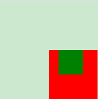
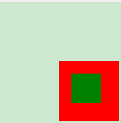
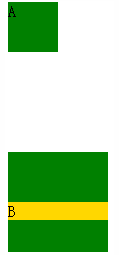
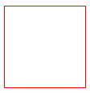

层叠样式表(英文全称：Cascading Style Sheets)

##### 1.介绍一下标准的CSS的盒子模型？低版本IE的盒子模型有什么不同的？

相关问题：盒子模型的区别border-box 和 content-box

1.1分类：IE盒子模型和标准W3C盒子模型

1.2盒子模型：content、padding、border、margin

1.3区别（IE的content部分把 border 和 padding计算了进去）

**W3C的标准Box Model**

外盒尺寸计算：

Element空间高度 = content height + padding + border + margin   

Element空间宽度 = content width + padding + border + margin   

内盒尺寸计算：

 Element Height = content height + padding + border

 Element Width = content width + padding + border

**传统下Box Model**

外盒尺寸计算：

Element空间高度 = content Height + margin

Element空间宽度 = content Width + margin

内盒尺寸计算：

 Element Height = content Height(Height包含了元素内容宽度，边框宽度，内距宽度)   

 Element Width = content Width(Width包含了元素内容宽度、边框宽度、内距宽度)

##### 2.CSS选择符有哪些？

###### 2.1 通配符选择器

*

###### 2.2 id选择器

(# idName)

###### 2.3 类选择器

(.className)类名中**包含**className即应用样式--多类选择器

###### 2.4 属性选择器

(a[attribute = attributeName])

**简单属性值选择**

有calss属性(值不限)的所有h1元素：**h1[class]**；

包含title属性的所有元素：**\*[title]**

同时包含href和title属性的HTML超链接元素：**a[href][title]**

**具体属性值选择**

class属性值是（**完全匹配，不是包含**）urgent warning的planet元素：**planet[class = "urgent warning"]**
**注意和类选择器的区别**

**部分属性值选择**

--其实就是词之间用空格分隔，可以根据其中任意一个词来进行选择，就和类选择器的用法类似

**p[class~="warning"]** 和p.warning是一致的，但是~可以用于所有所有属性，不止class属性

**css3新增--子串匹配属性选择器(3个)**

**[attribute^="value"]**

eg:a[src^="https"] 选择其 src 属性值以 "https" 开头的每个 a 元素。

**[attribute$="value"]**

eg:a[src$=".pdf"] 选择其 src 属性以 ".pdf" 结尾的所有a元素

**[attribute*="value"]**

eg:a[src*="abc"] 选择其 src 属性中包含 "abc" 子串的每个 a 元素。

[class*="col-"]类名中包含col-子串的元素

**特定属性选择类型**

**[attribute|="value"]**

eg：| 只匹配连字符分割的属性，比如*[lang|=en] 匹配 lang属性等于en或者以en-开头的所有元素

###### 2.5 标签选择器

div, h1, p等

###### 2.6 后代选择器

li a

###### 2.7 子选择器

ul > li

不想选择一个任意的后代元素，希望缩小范围，只选择另一个元素的子元素

###### 2.8 相邻选择器

h1 + p

选择紧接在一个h1元素后出现的所有段落，h1要和p元素有共同的父元素

###### 2.9 伪类选择器

a:link,a:visited,a:hover,a:active

p:first-letter,p:first-line,p:first-child

p:before,p:after

**css3新增的伪类选择器**

http://blog.csdn.net/github_34514750/article/details/51122212

eg:p:only-child 选择属于其父元素的唯一子元素的每个 <p> 元素。

##### 3.css哪些属性可以继承？哪些不可继承？

**css属性分类**

**字体属性：**

font-family,font-size,font-style,font-variant,font-weight,font可继承

**ps：** font-size继承的是计算后的实际值

**文本属性：**

word-spacing word-break letter-spacing text-align text-transform text-indent text-shadow line-height可以继承

text-decoration vertical-align不可继承

**颜色背景属性：**

color可以继承

background(background-color background-image background-repeat background-attachment background-position)不可继承

**边框属性：**

border(border-top border-right border-bottom border-left)(border-width border-style border-color)不可以继承

**定位和布局属性：**

margin padding width height float clear position left top overflow z-index display不可以继承

**列表属性：**

list-style-image, list-style-position,list-style-type, list-style可以继承

##### 4.伪类和伪元素的差别？

1. 伪类是通过给子元素添加一个类，然后定义这个类的样式来实现效果

    eg:  :link :visited :hover :active :focus :first-child

   伪元素是通过添加一个实际的元素，在给元素添加样式来实现效果的。

   eg:  :first-letter :first-line :before :after
```
       <style>
            p>i:first-child {color: red}
       </style>
       <p>
        <i>first</i>
        <i>second</i>
       </p>
       伪类实现其实是
       <style>
       .first-child {color: red}
       </style>
       <p>
            <i class="first-child">first</i>
            <i>second</i>
       </p>
       http://segmentfault.com/img/bVcccn

        <style>
            p:first-letter {color: red}
       </style>
       <p>I am stephen lee.</p>

       伪元素实现其实是

       <style>
            .first-letter {color: red}
        </style>
        <p><span class='first-letter'>I</span> am stephen lee.</p>
```

 2.css3中为了区分二者：伪类用: 但是伪元素用::

 但因为兼容性的问题，所以现在大部分还是统一的单冒号，但是抛开兼容性的问题，我们在书写时应该尽可能养成好习惯，区分两者。

##### 5.CSS优先级算法(特殊性值)如何计算？

相关问题：选择器优先级

CSS 中字母 'C' 的意思是叠层 (Cascading)。请问在确定样式的过程中优先级是如何决定的 (请举例)？如何有效使用此系统？

**1.css优先级**

是由四个级别和各个级别出现的次数决定的，值从左到右，左面的最大，一级大于一级

**2.优先级算法**

每个规则对应一个初始四位数：0,0,0,0

若是行内样式优先级，则是1,0,0,0，高于外部定义

    <div style=”color: red”>sjweb</div>

若是ID选择符，则分别加0,1,0,0

若是类选择符，属性选择符，伪类选择符，则分别加0,0,1,0

若是元素选择器，伪元素选择器，则分别加0,0,0,1

**3.需要注意**

!important的优先级是最高的，但出现冲突时则需比较”四位数“

优先级相同时，则采用就近原则

继承得来的属性，其优先级最低

**4.实例**

body div p{color: green;}--Specificity值为0,0,0,3

Div # sjweb { font-size:12px;}--Specificity值为 0,1,0,1

html > body div [id=”totals”] ul li > p {color:red;}--Specificity值为 0,0,1,6

##### 6.CSS3新增选择器，伪元素，伪类有那些？

###### 6.1.css3新增的3个属性选择器

```
[attribute^="value"]
eg:a[src^="https"] 选择其 src 属性值以 "https" 开头的每个 <a> 元素。
```

```
[attribute$="value"]
eg:a[src$=".pdf"] 选择其 src 属性以 ".pdf" 结尾的所有 <a> 元素
//所以可以使用css3实现不同文件给与不同图标，没有css3则我们只可以辛苦用js实现了~
```

```
[attribute*="value"]
eg:a[src*="abc"] 选择其 src 属性中包含 "abc" 子串的每个 <a> 元素。
[class*="col-"]类名中包含col-子串的元素
```
###### 6.2.css3新增的结构伪类选择器

  n可以是even、odd（表格常用）、m*n+偏移量（m自己定一个值）、数字


```
:only-child
eg:p:only-child 选择属于其父元素的唯一子元素的每个 <p> 元素。
```

```
:nth-child(n)
eg:p:nth-child(2) 选择属于其父元素的第二个子元素的每个 <p> 元素。
p:nth-child(2) 匹配<div><h1></h1><p></p><p></p></div>片段中的第二个元素，但却是第一个p元素
```

```
:nth-last-child(n)
eg：p:nth-last-child(2) 同上，从最后一个子元素开始计数。
```

```
:last-child
eg:p:last-child 选择属于其父元素最后一个子元素每个 <p> 元素。
```

```
:nth-of-type(n)
eg:p:nth-of-type(2) 选择属于其父元素第二个 <p> 元素的每个 <p> 元素。
p.nth-of-type(2)
匹配<div><h1></h1><p></p><p></p></div>片段中的第二个p元素
```

```
:nth-last-of-type(n)
eg:p:nth-last-of-type(2) 同上，但是从最后一个子元素开始计数。

```

```
:first-of-type  
eg:p:first-of-type 选择属于其父元素的首个 <p> 元素的每个 <p> 元素。
```

```
:last-of-type  
eg:p:last-of-type 选择属于其父元素的最后 <p> 元素的每个 <p> 元素。
```

```
:only-of-type  
eg:p:only-of-type 选择属于其父元素唯一的 <p> 元素的每个 <p> 元素。

```

```
:root  
eg::root 选择文档的根元素。
```

```
:empty  
eg:p:empty 选择没有子元素的每个 <p> 元素（包括文本节点）。
```

###### 6.3.UI元素状态伪类选择器

这几个状态伪类选择器在IE7，8不支持，其他浏览器都支持的比较好，如今IE7,8在国内用户还比较多，不推荐使用，但是当IE9广泛使用时，则需要积极使用这几个状态伪类选择器。

```
 :enabled  
 eg:input:enabled 选择每个启用的 <input> 元素。

```

```
:disabled  
eg:input:disabled 选择每个禁用的 <input> 元素
```

```
:checked
eg:input:checked 选择每个被选中的 <input> 元素。
```
###### 6.4.css3新增的其他选择器列表

```
//主流浏览器一般都对此支持
E~F：选择匹配F的所有元素，且匹配元素位于匹配E的元素后面（EF需要同级）
eg：div~p匹配<div><p>1</p></div><p>2</p>，则匹配到<p>2</p>，无<p>1</p>
```

```
//选择器在IE7，8不支持，其他浏览器都支持的比较好，如今IE7,8在国内用户还比较多，不推荐使用，但是当IE9广泛使用时，则需要积极使用这几个状态伪类选择器。
 :target  
 eg:#news:target 选择当前活动的 #news 元素。

```
```
//选择器在IE7，8不支持，其他浏览器都支持的比较好，如今IE7,8在国内用户还比较多，不推荐使用，但是当IE9广泛使用时，则需要积极使用这几个状态伪类选择器。
:not(selector)  
eg::not(p) 选择非 <p> 元素的每个元素。
```
```
:focus(鼠标点入之后)
--这个文本框focus动画效果感觉蛮好看的~，代码如下
input:focus{
    width: 200px;
    transition: width 2s;
    border: #87c6f9 1px solid;
    box-shadow: 0 0 8px rgba(103,166,217,1);
}
```
###### 6.5.实例-制作优雅表格

```
table{
  width: 70%;
  font-size: 14px;
  font-family: SimHei;
  /*设计表格要习惯的加如下声明*/
  border-collapse: collapse;
  empty-cells: show;
  table-layout: fixed;
  border: 1px solid #cad9ea;
}

th{
  height: 30px;
}
td{
  height: 25px;
}

th,td{
  border: 1px solid #cad9ea;
  padding: 2px;
}
/*浅色颜色舒服*/
tr:nth-child(even) {
  background-color: #f5fafe;
}

```

```

<!doctype html>
<html>
  <head>
    <meta charset="utf-8">
    <link href="index.css" rel="stylesheet">
    <title>优雅的数据表格</title>
  </head>

  <body>

    <table>
      <caption>优雅的数据表格</caption>
      <thead>
        <th>排名</th>
        <th>校名</th>
        <th>总得分</th>
        <th>人才培养得分</th>
        <th>研究生培养得分</th>
        <th>本科生培养得分</th>
      </thead>

      <tbody>
        <tr>
          <td></td>
          <td></td>
          <td></td>
          <td></td>
          <td></td>
          <td></td>
        </tr>

        <tr>
          <td></td>
          <td></td>
          <td></td>
          <td></td>
          <td></td>
          <td></td>
        </tr>

        <tr>
          <td></td>
          <td></td>
          <td></td>
          <td></td>
          <td></td>
          <td></td>
        </tr>

        <tr>
          <td></td>
          <td></td>
          <td></td>
          <td></td>
          <td></td>
          <td></td>
        </tr>

        <tr>
          <td></td>
          <td></td>
          <td></td>
          <td></td>
          <td></td>
          <td></td>
        </tr>

        <tr>
          <td></td>
          <td></td>
          <td></td>
          <td></td>
          <td></td>
          <td></td>
        </tr>

        <tr>
          <td></td>
          <td></td>
          <td></td>
          <td></td>
          <td></td>
          <td></td>
        </tr>
      </tbody>
    </table>

  </body>
</html>

```


##### 7.元素的水平居中？垂直居中？水平垂直居中？

**水平居中**

1.如果需要居中的是常规流中inline元素---图片，按钮，文字等行内元素(display为inline或inline-block等)

则在 **父元素** 中使用text-align: center;

```
<div class="content">
    <span>a aa a</span>
</div>

<style>
   .content{
        width: 500px;
        border: 1px solid black;
        text-align: center;
   }
</style>
```

2.如果需要居中的是常规流中block元素---是常规流，对浮动元素或绝对定位元素无效。

则需要为

1.元素设置宽度，
2.设置左右margin为auto，
3.IE6下需在父元素上设置text-align: center;再给子元素恢复需要的值

```
<body>
    <div class="content">
    aaaaaa aaaaaa a a a a a a a a
    </div>
</body>

<style>
    body {
        background: #DDD;
        text-align: center; /* 3 */
    }
    .content {
        width: 500px;      /* 1 */
        text-align: left;  /* 3 */
        margin: 0 auto;    /* 2 */

        background: purple;
    }
</style>
```

或者使用inline-block水平居中

仅inline-block属性是无法让元素水平居中，display:inline-block;
关键之处要在元素的父容器中设置text-align的属性为“center”，这样才能达到效果

3.如果需要居中的元素为浮动元素

则需要为
1.为元素设置宽度
2.position: relative
3.浮动方向偏移量（left或者right）设置为50%
4.浮动方向上的margin设置为元素宽度一半乘以-1

浮动居中的原理是：把浮动元素相对定位到父元素宽度50%的地方，但这个时候元素还不是居中的，而是比居中的那个位置多出了自身一半的宽度，这时就需要他里面的子元素再用一个相对定位，把那多出的自身一半的宽度拉回来，而因为相对定位正是相对于自身来定位的，所以自身一半的宽度只要把left 或 right 设为50%就可以得到了，因而不用知道自身的实际宽度是多少。

这种使用浮动配合相对定位来居中的方法，优点是不用知道要居中的元素的宽度，即使这个宽度是不断变化的也行；缺点是需要一个多余的元素来包裹要居中的元素。

```
<body>
    <div class="content">
    aaaaaa aaaaaa a a a a a a a a
    </div>
</body>

<style>
    body {
        background: #DDD;
    }
    .content {
        width: 500px;         /* 1 */
        float: left;

        position: relative;   /* 2 */
        left: 50%;            /* 3 */
        margin-left: -250px;  /* 4 */

        background-color: purple;
    }
</style>
```

```
<head>
<style>
    body{
        margin:0;
        padding:0;
    }
    .parent{
        width:300px;
        height:200px;
        border:1px solid red;
    }
    /*浮动居中的方法需要有这么一个包裹的元素，需要浮动的就是哲哥元素*/
    .wraper{
        float:left;//在哲哥包裹元素上浮动，让它自适应的宽度
        position:relative;
        left:50%;//相对定位到父元素宽度一半的地方
        clear:both;
    }
    .child{
        border:1px solid blue;//这个是真正需要居中的元素
        position:relative;//在这个元素上进行相对定位
        left:-50%;//向左偏移本身的一半宽度，正好就居中了
        white-space:nowrap;
    }
</style>

</head>
<body>
    <div class="parent">
        <div class="wraper">
            <div class="child">我水平居中了</div>
        </div>
        <div class="wraper" style="margin-top:20px;">
            <div class="child">宽度不同</div>
        </div>
        <div class="wraper" style="margin-top:20px;">
            <div class="child">确实啊</div>
        </div>
    </div>
</body>
```

4.如果需要居中的元素为绝对定位元素

则需要1.为元素设置宽度 2.偏移量设置为50% 3.偏移方向外边距设置为元素宽度一半乘以-1
```
<body>
    <div class="content">
    aaaaaa aaaaaa a a a a a a a a
    </div>
</body>

<style>
    body {
        background: #DDD;
        position: relative;
    }
    .content {
        width: 800px;/* 1 */

        position: absolute;
        left: 50%;/* 2 */
        margin-left: -400px;/* 3 */

        background-color: purple;
    }
</style>
```

或者

需要1.为元素设置宽度 2.设置左右偏移量都为0 3.设置左右外边距都为auto

```
<body>
    <div class="content">
    aaaaaa aaaaaa a a a a a a a a
    </div>
</body>

<style>
    body {
        background: #DDD;
        position: relative;
    }
    .content {
        width: 800px;/* 1 */

        position: absolute;
        margin: 0 auto;/* 3 */
        left: 0;/* 2 */
        right: 0;/* 2 */

        background-color: purple;
    }
</style>
```

**垂直居中**

1.使用line-height让单行的文字垂直居中

把文字的line-height设为文字父容器的高度，适用于只有一行文字的情况。

Vertical-align is similar. It also applies to table cells and it works with some inline elements.不用于块级元素

2.利用font-size来实现垂直居中

如果父元素高度是已知的，要把它里面的子元素进行水平垂直居中，则可以使用这种方法，且子元素的宽度或高度都不必知道。

该方法只对IE6和IE7有效。

该方法的要点是给父元素设一个合适的font-size的值，这个值的取值为该父元素的高度除以1.14得到的值，并且子元素必须 是一个inline或inline-block元素，需要加上vertical-align:middle属性。

至于为什么是除以1.14而不是其他的数，还真没有人知道，你只需要记住1.14这个数就行了。

3.使用表格

如果你使用的是表格的话，那完全不用为各种居中问题而烦恼了，只要用到 td(也可能会用到 th)元素的 align=”center” 以及 valign=”middle” 这两个属性就可以完美的处理它里面内容的水平和垂直居中问题了,而且表格默认的就会对它里面的内容进行垂直居中。如果想在css中控制表格内容的居中，垂直居中可以使用 vertical-align:middle，至于水平居中，貌似css中是没有相对应的属性的,但是在IE6、7中我们可以使用text-align:center来对表格里的元素进行水平居中，IE8+以及谷歌、火狐等浏览器的text-align:center只对行内元素起作用，对块状元素无效。

```
<table>
    <tr>
        <td height="200" width="200" style="border:1px solid red;vertical-align:top;text-align:center;">
            <div style="width:100px;height:100px;background:#000;"></div>
        </td>
    </tr>
</table>
```

**水平垂直居中**

1.使用display:table-cell来居中

对于那些不是表格的元素，我们可以通过display:table-cell 来把它模拟成一个表格单元格，这样就可以利用表格那很方便的居中特性了。例如：

```
<div style="display:table-cell;vertical-align:middle;text-align:center;width:200px;height:200px;border:1px solid black;">
    <div style="width:50px;height:50px;background:#03F;display:inline-block;"></div>
</div>
```
如何居中div？如何居中一个浮动元素？如何让绝对定位的div居中？
居中div

    div{
        width:100px;
        height:100px;
        margin:0 auto;
    }

居中一个浮动元素：

    div{
        width:500px;
        height:300px;
        position:relative;
        top:50%;
        left:50%;
        margin:-150px 0 0 -250px;
    }


让绝对定位的div居中：

    div{

    }

##### 8.display有哪些值？说明他们的作用。

bloc/inline/inline-block/none/table/inherit

**block**

像块类型元素一样显示

**inline** 注意和inline-block的区别

默认。此元素会被显示为内联元素，元素前后没有换行符。

**inline-block**

像行内元素一样显示，但其内容像块类型元素一样显示

内联块元素

（1）元素之间可以水平排列

（2）可以当做一个块级元素来设置各种的属性，例如：width、height、padding等。

**table**

此元素会作为块级表格来显示（类似 <table>），表格前后带有换行符。

**none**

缺省值。象行内元素类型一样显示。

**inherit**

规定应该从父元素继承 display 属性的值

##### 9.position的值relative和absolute定位原点是？position有几个属性？

static/relative/absolute/fixed/inherit

**static**

1.默认值，没有定位

2.元素出现在正常的流中

**relative**

1.生成相对定位的元素

2.元素在文档流中

3.相对于本来位置的顶部和左部进行定位

**absolute**

1.生成绝对定位的元素

2.元素脱离了文档流

3.位置是相对于position值不为static的第一个父元素进行定位，若没有这样一个祖先，则相对于原始的容器

**fixed**

1.生成绝对定位的元素

2.元素脱离了文档流

3.相对于浏览器窗口进行定位

**inherit**

规定从父元素继承position属性的值

##### 10.CSS3有哪些新特性？

**1.增加了border-raduis特性**

border-top-left-radius
border-top-right-radius
border-bottom-right-raduis
border-bottom-left-raduis

**2.新增了选择器和伪类**

新增的选择器：

[attribute^="value"]匹配字串的开头

[attribute$="value"]匹配字串的结尾

[attribute*="value"]匹配字串

新增的伪类：

:only-child/:nth-child()/:nth-last-child()/:last-child

:nth-of-type()/:nth-last-of-child()/:first-of-type/:only-of-type/:last-of-type

:root/:empty

http://blog.csdn.net/github_34514750/article/details/51122212


**3.新增了很多动画效果**

perspective

translate-style

translate:scale/skew/translate/rotate

animate

transition

gradient线性渐变

**4.颜色模式**

rgba()

**5.文字特效**

文字特效      （text-shadow、）
文字渲染      （Text-decoration）

**6.新增文本功能**

direction 定义文字排列方式(全兼容) ---rtl 从右向左排列,ltr 从右向左排列  注意要配合unicode-bidi:bidi-override; 一块使用
text-overflow 定义省略文本的处理方式--clip 无省略号  Ellipsis 省略号 (注意配合overflow:hidden和white-space:nowrap一块使用)

**5.阴影和反射**

阴影和反射        （Shadow\Reflect）

**6.多列布局**

多列布局        （multi-column layout）

##### 11.请解释一下CSS3的Flexbox（弹性盒布局模型）,以及适用场景？

见css布局中的flex布局
画四分之一圆的时候，是画出一个圆并且结合overflow等实现，但是其实可以直接画出半圆或者四分之一圆，之前忽略了几个属性。

##### 12.用纯CSS创建一个三角形的原理是什么？纯CSS创建其他图形。

**三角形**
基于盒子模型，不给content的宽高，设置border，将上、左、右三条边隐藏掉

    {
        width:0;
        height:0;
        border-width:20px;
        border-style:solid;
        border-color:transparent transparent red transparent;
    }

圆的画法：先画相应矩形，在用border-radius

**画出圆**
```
{
  width:100px;
  height:100px;
  border-radius:50px;
}
```
**画出方向四个不同的本圆**

```
.top
{
  width: 100px;
  height: 50px;
  border-radius: 50px 50px 0 0;
}
.right {
  height: 100px;
  width: 50px;
  border-radius: 0 50px 50px 0;
}
.bottom {
  width: 100px;
  height: 50px;
  border-radius: 0 0 50px 50px;
}
.left {
  width: 50px;
  height: 100px;
  border-radius: 50px 0 0 50px;
}
```
**画出四分之一个圆方法**

```
{
  width:50px;
  height:50px;
  border-radius:50px 0 0 0;
}
```

**椭圆**

```
<div class="ellipse">
</div>
 .ellipse{
    width: 200px;
    height: 100px;
    border-radius: 50%;
    background: black;
}

```

**沿横轴、纵轴劈开的半椭圆**

```
<div class="x-ellipse">
</div>
<div class="y-ellipse">
</div>

.x-ellipse{
    width: 200px;
    height: 150px;
    border-radius: 50%/ 100% 100% 0 0;
    /*相当于50% 50% 50% 50%/ 100% 100% 0 0;*/
    background: black;
}
.y-ellipse{
    width: 200px;
    height: 150px;
    border-radius: 100% 0 0 100%/50%;
    background: black;
}        
```


**四分之一椭圆**

```
<div class="quarter-ellipse">
</div>
.quarter-ellipse{
    width: 200px;
    height: 150px;
    border-radius: 100% 0 0 0;
    background: black;
}
```


**菱形**
如果想让形状变形，但是里边的字体不变形

思路：
变形之后，再让里边内容旋转回来

```
<div class="paralle"><p>transform:skew()</p></div>

.paralle {
    position: relative;
    left: 100px;
    width:200px;
    height: 100px;
    background:#44a5fc;

    line-height: 100px;
    text-align: center;
    font-weight: bolder;

    transform: skew(-20deg);
}
.paralle p{
    transform: skew(20deg);
}

```


**三角形**

```
#triangle-up {
    width: 0;
    height: 0;
    border-left: 50px solid transparent;
    border-right: 50px solid transparent;
    border-bottom: 100px solid lightblue;
}
#triangle-down {
    width: 0;
    height: 0;
    border-left: 50px solid transparent;
    border-right: 50px solid transparent;
    border-top: 100px solid lightblue;
}

#triangle-left {
    width: 0;
    height: 0;
    border-top: 50px solid transparent;
    border-right: 100px solid lightblue;
    border-bottom: 50px solid transparent;
}
#triangle-right {
    width: 0;
    height: 0;
    border-top: 50px solid transparent;
    border-left: 100px solid lightblue;
    border-bottom: 50px solid transparent;
}
#triangle-topleft {
    width: 0;
    height: 0;
    border-top: 100px solid lightblue;
    border-right: 100px solid transparent;
}
#triangle-topright {
    width: 0;
    height: 0;
    border-top: 100px solid lightblue;
    border-left: 100px solid transparent;
}
#triangle-bottomleft {
    width: 0;
    height: 0;
    border-bottom: 100px solid lightblue;
    border-right: 100px solid transparent;
}
#triangle-bottomright {
    width: 0;
    height: 0;
    border-bottom: 100px solid lightblue;
    border-left: 100px solid transparent;
}
```


**一些属性的说明**

border-radius:50px 0 0 0
等价于将border-raduis属性分成四个属性来设置，把一个圆分成上左，上右，下右，下左4份
border-top-left-radius:
border-top-right-radius:
border-bottom-right-radius:
border-bottom-left-radius:

首选需要了解border-radius
border-radius可以是元素也可是百分比。
border-radius:border-top-left-radius,border-top-right-radius,
              border-bottom-right-radius,border-bottom-left-radius;
不仅仅可以为四个角分别设置值，甚至可以给每个角提供水平和垂直半径
方法是在斜杠前指定 1~4 个值，在斜杠后指定另外 1~4 个值
举例来说，
当 border-radius 的值为10px / 5px 20px 时，
其效果相当于 10px 10px 10px 10px / 5px 20px 5px 20px 。

##### 14.经常遇到的浏览器的兼容性有哪些？原因，解决方法是什么，常用hack的技巧 ？

1.浏览器默认的margin和padding不同，解决方法是使用如下代码统一
```
    *{
        margin:0;
        padding:0;
    }

2.
```
##### 15.li与li之间有看不见的空白间隔是什么原因引起的？有什么解决办法？

元素的子节点(li标签之间有空白是如何形成的)
```
<!-- IE解析成3个子节点，但是其他浏览器解析成7个节点(3个li元素节点和4个空白文本节点) -->
<ul id="myList">
    <li>Item 1</li>
    <li>Item 2</li>
    <li>Item 3</li>
</ul>
```

解决办法：
所以要想遍历li标签的方法如下两种：

1.childNode遍历

2.直接使用getElementsByTagName
```
var ulList = document.getElementById("myList");

for(var i = 0 ,len = ulList.childNodes.length;i < len;i++) {
    <!-- 确保是li子节点 -->
    if(ulList.childNodes[i].nodeType == 1) {
        // do something
    }
}
```

```
var ulList = document.getElementById("myList");
var items = ulList.getElementsByTagName("li");
```

##### 16.为什么要初始化CSS样式?

1.浏览器的兼容性问题，不同浏览器对有些标签的默认值不同，若不对css初始化可能会导致浏览器之间的页面显示差异

2.初始化页面会比较方便，简化代码

3.初始化代码

```
    *{
        margin:0;
        padding:0;
    }

上述初始化虽然简单，但是其实很不推荐，如果网站很大，css样式表文件很多，他会把所有的标签都初始化一遍，这样就大大的加强了网站运行的负载，会使网站加载的时候需要很长一段时间。

腾讯QQ官网(http://www.qq.com)样式初始化

    body,ol,ul,h1,h2,h3,h4,h5,h6,p,th,td,dl,dd,form,fieldset,legend,input,textarea,select{margin:0;padding:0}
    body{font:12px"宋体","Arial Narrow",HELVETICA;background:#fff;-webkit-text-size-adjust:100%;}
    a{color:#2d374b;text-decoration:none}
    a:hover{color:#cd0200;text-decoration:underline}
    em{font-style:normal}
    li{list-style:none}
    img{border:0;vertical-align:middle}
    table{border-collapse:collapse;border-spacing:0}
    p{word-wrap:break-word}
```

##### 17.absolute的containing block计算方式跟正常流有什么不同？

**正常流的包含块：**

包含块由最近的块级祖先框，表单元格或行内块祖先框的内容边界构成。

**浮动元素的包含块：**

最近的块级祖先元素，浮动元素尽管是行内元素也会生成一个块级框

**定位的包含块**

根元素：

用户代理（比如浏览器）选择根元素（有的浏览器是html，有的是body）作为 containing block

非根元素：

1.position是relative或者static，包含块是最近的块级祖先框，表单元格或行内块祖先框的内容边界构成。

2.position是absolute，包含块由最近的position值不是static的块元素。

  如果祖先是块级元素，containing block 由祖先的 padding edge 形成。

  如果祖先是内联元素，containing block 取决于祖先的 direction 属性。

  1.如果 direction 是 ltr（左到右），祖先产生的第一个盒子的上、左内容边界是 containing block 的上方和左方，祖先的最后一个盒子的下、右内容边界是 containing block 的下方和右方。

  2.如果 direction 是 rtl（右到左），祖先产生的第一个盒子的上、右内容边界是 containing block 的上方和右方，祖先的最后一个盒子的下、左内容边界是 containing block 的下方和左方。

  如果没有祖先，根元素盒子的内容边界确定为 containing block。

3.position是fixed，包含块是视窗本身

##### 18.CSS里的visibility属性有个collapse属性值是干嘛用的？在不同浏览器下以后什么区别？

visibility:hidden/visible/inherit/collapse

visibility:collapse 当在表格中使用的时候，此值可以删除一行或者一列。值被应用于其他元素时，则呈现为hidden

**html代码：**

    <table cellspacing="0" class="table">
        <tr>
            <th>Fruits</th>
            <th>Vegetables</th>
            <th>Rocks</th>
        </tr>
        <tr>
            <td>Apple</td>
            <td>Celery</td>
            <td>Granite</td>
        </tr>
        <tr>
            <td>Orange</td>
            <td>Cabbage</td>
            <td>Flint</td>
        </tr>
    </table>

    <p><button>collapse行1</button></p>

    <p><button>hide行1</button></p>

    <p><button>重置</button></p>

**css代码：**

    body {
      text-align: center;
      padding-top: 20px;
      font-family: Arial, sans-serif;
    }

    table {
      border-collapse: separate;
      border-spacing: 5px;
      border: solid 1px black;
      width: 500px;
      margin: 0 auto;
    }

    th, td {
      text-align: center;
      border: solid 1px black;
      padding: 10px;
    }

    .vc {
      visibility: collapse;
    }

    .vh {
      visibility: hidden;
    }

    button {
      margin-top: 5px;
    }

**js代码：**

    var btns = document.getElementsByTagName('button'),
    rows = document.getElementsByTagName('tr');

    btns[0].addEventListener('click', function () {
    rows[1].className = 'vc';
    }, false);

    btns[1].addEventListener('click', function () {
    rows[1].className = 'vh';
    }, false);

    btns[2].addEventListener('click', function () {
    rows[1].className = '';
    }, false);

http://www.webhek.com/visibility-collapse

##### 19.position跟display、margin collapse、overflow、float这些特性相互叠加后会怎么样？

display的转换对应表

| 设定值  | 计算值  |
| :------------ |:---------------:|
|inline-table |table |
|inline, run-in, table-row-group, table-column, table-column-group, table-header-group, table-footer-group, table-row, table-cell, table-caption, inline-block|block|
|其他|同设定值|

**position，float，display的关系和优先级**

**1.display值是none**

如果display是none，则position和float不起作用。因为元素不产生框，因此浮动和定位无效。若display不是none，则继续

**2. 'position' 的值是 'absolute' 或 'fixed'**

框是相对定位的，计算后的float应该是none。并且display按照上表设置。框的位置将由 'top'，'right'，'bottom' 和 'left' 属性和该框的包含块确定。

也就是说，当元素是绝对定位时，浮动失效，'display' 会被按规则重置。
若position不是absolute或fixed，则继续

**3.float的值不是none**

如果float值不是none，则该框浮动并且display按照转换对应表设置，若float是none

**4.元素是根元素**

如果元素是根元素，display值按照对应表设置，否则，按照5

**5.应用指定的display特性值**

**margin collapse外边距折叠**

**1.多个相邻（兄弟或者父子关系）普通流的块元素垂直方向marigin会重叠**

**折叠的结果：**

两个相邻的外边距都是正数时，折叠结果是它们两者之间较大的值。

两个相邻的外边距都是负数时，折叠结果是两者绝对值的较大值。

两个外边距一正一负时，折叠结果是两者的相加的和。

**折叠的产生情况：**

1.必须是处于常规文档流（非float和绝对定位）的块级盒子,并且处于同一个BFC当中。

2.没有线盒，没有空隙（clearance，下面会讲到），没有padding和border将他们分隔开(ps
    :所以解决办法中有padding或者border两种办法)

3.都属于垂直方向上相邻的外边距，可以是下面任意一种情况  

元素的margin-top与其第一个常规文档流的子元素的margin-top

元素的margin-bottom与其下一个常规文档流的兄弟元素的margin-top

height为auto的元素的margin-bottom与其最后一个常规文档流的子元素的margin-bottom

高度为0并且最小高度也为0，不包含常规文档流的子元素，并且自身没有建立新的BFC的元素的margin-top和margin-bottom


**块元素是同级关系**

margin-bottom和margin-top取较大值
```
<div id="div1"></div>
<div id="div3"></div>

/*如下，margin合并了是200px*/
#div1{
    width: 100px;
    height: 100px;
    margin: 100px 0 0 100px;
    margin-bottom:200px;
    background: red;

}
#div3{
    margin-top:160px;
    width: 50px;
    height: 50px;
    background: green;
}
```


**块元素是父子关系**

marigin-top会取较大值

```
<div id="div1">
    <div id="div2"></div>
</div>

/*如下，margin-top是100px，若div2的margin-top为120px，则是120px，永远选较大的。两者上部贴合*/
#div1{
    width: 100px;
    height: 100px;
    margin: 100px 0 0 100px;
    margin-bottom:200px;
    background: red;
}
#div2{
    width: 50px;
    height: 50px;
    margin-top: 20px;
    margin-left: 20px;
    background: green;
}
```


**解决父子DIV顶部外边距折叠办法：**

1.给父元素div设置边框

```
#div1{
    width: 100px;
    height: 100px;
    margin: 100px 0 0 100px;
    margin-bottom:200px;
    background: red;
    border:1px solid transparent;
}
#div2{
    width: 50px;
    height: 50px;
    margin-top: 20px;
    margin-left: 20px;
    background: green;
}
```


2.给父元素div设置padding

```
#div1{
    width: 100px;
    height: 100px;
    margin: 100px 0 0 100px;
    margin-bottom:200px;
    background: red;
    padding:1px;
}
#div2{
    width: 50px;
    height: 50px;
    margin-top: 20px;
    margin-left: 20px;
    background: green;
}
```


3.给父元素div设置overflow--其实是生成了一个新的BFC

```
#div1{
    width: 100px;
    height: 100px;
    margin: 100px 0 0 100px;
    margin-bottom:200px;
    background: red;
    overflow:hidden;
}
#div2{
    width: 50px;
    height: 50px;
    margin-top: 20px;
    margin-left: 20px;
    background: green;
}
```


**2.绝对定位元素，float元素，inline-box元素，overflow : hidden不会和垂直方向上的其他元素margin折叠--其实就是可以生成新的BFC**

```
<div style="margin-bottom:50px;width:50px; height:50px; background-color:green;">A</div>
<div style="margin-top:50px; width:100px; height:100px; background-color:green; float:left;">
    <div style="margin-top:50px;background-color:gold;">B</div>
</div>
```


两个绿色的块儿之间，相距100px，而若 B 和它的浮动包含块发生 margin 折叠的话，金色的条应该位于绿色块的最上方，显然，没有发生折叠。inline-block 元素、绝对定位元素的 margin同样如此， 不会和垂直方向上其他元素的 margin 折叠。

**3.元素自身的 margin-bottom 和 margin-top 相邻时也会折叠**

自身 margin-bottom 和 margin-top 相邻，只能是自身内容为空，垂直方向上 border、padding 为 0。

```
<div style="border:1px solid red; width:100px;">
    <div style="margin-top: 100px;margin-bottom: 50px;></div>
</div>
```

以上代码运行后，我们讲得到的是红色边框的正方形，方框的宽高都应该是 100px，高度不应该是 150px。



**overflow和position**

css规范中规定此属性overflow：

如果后代元素的包含块是整个视窗或者是定义overflow元素的父元素，则不裁剪。其余溢出则可裁剪。---其实就是要想彻底剪裁它的所有子元素，它不但要有overflow:hidden，而且还要作为所有子元素的包含块。

前边我们说过绝对定位（position:absolute）的元素的包含块由最近的position值不是static的块元素。

因此若同时满足下列两个条件则不裁剪：

1.内部溢出的元素是通过position:absolute绝对定位

2.拥有overflow:hidden样式的块元素不具有position:relative相对 和position:absolute绝对定位。

##### 20.对BFC规范(块级格式化上下文：block formatting context)的理解？

它是一个独立容器，决定了元素如何对其内容进行定位,以及与其他元素的关系和相互作用。

一个页面是由很多个 Box 组成的,元素的类型和 display 属性,决定了这个 Box 的类型。

 不同类型的 Box,会参与不同的 Formatting Context（决定如何渲染文档的容器）,因此Box内的元素会以不同的方式渲染,也就是说BFC内部的元素和外部的元素不会互相影响。

http://blog.csdn.net/github_34514750/article/details/51364202

##### 21.CSS权重优先级是如何计算的？

以下是权重的规则：标签的权重为1，class的权重为10，id的权重为100，以下例子是演示各种定义的权重值：

    /*权重为1*/
    div{
    }
    /*权重为10*/
    .class1{
    }
    /*权重为100*/
    #id1{
    }
    /*权重为100+1=101*/
    #id1 div{
    }
    /*权重为10+1=11*/
    .class1 div{
    }
    /*权重为10+10+1=21*/
    .class1 .class2 div{
    }

如果权重相同，则最后定义的样式会起作用，但是应该避免这种情况出现

##### 22.请解释一下为什么会出现浮动和什么时候需要清除浮动？清除浮动的方式和优劣。

**出现浮动的原因：**

为了方便布局，出现了浮动元素，可以方便的让元素移动。但是浮动元素也就脱离了正常流，正是因为这种特性

**需要清除浮动的情况：**

1.浮动框高度超出包含框的时候，也就会出现包含框不会 自动伸高来闭合浮动元素（“高度塌陷”现象）。

2.导致本属于普通流中的元素浮动之后，包含框内部由于不存在其他普通流元素了，也就表现出高度为0（高度塌陷）

**清除浮动的方法，也要注意推荐使用的方法：**

**1.父级div定义height**
```
<div class="div1">
    <div class="left">Left</div>
    <div class="right">Right</div>
</div>
<style>
   .div1{background:#000080;border:1px solid red;/*解决代码*/height:200px;}

   .left{float:left;width:20%;height:200px;background:#DDD}
   .right{float:right;width:30%;height:80px;background:#DDD}
</style>

```
•原理：父级div手动定义height，就解决了父级div无法自动获取到高度的问题

•优点：简单，代码少，容易掌握

•缺点：只适合高度固定的布局，要给出精确的高度，如果高度和父级div不一样时，会产生问题

•建议：不推荐使用，只建议高度固定的布局时使用

**2.结尾处加空div标签clear:both**

```
<div class="div1">
    <div class="left">Left</div>
    <div class="right">Right</div>
    <div class="clearfloat"></div>
</div>
<style>
   .div1{background:#000080;border:1px solid red;}

   .left{float:left;width:20%;height:200px;background:#DDD}
   .right{float:right;width:30%;height:80px;background:#DDD}
   /*解决代码*/
   .clearfloat{
       clear:both;
   }
</style>
```

•原理：添加一个空div，利用css提高的clear:both清除浮动，让父级div能自动获取到高度

•优点：简单，代码少，浏览器支持好，不容易出现怪问题

•缺点：不少初学者不理解原理；如果页面浮动布局多，就要增加很多空div，让人感觉很不爽

•建议：不推荐使用，但此方法是以前主要使用的一种清除浮动方法

**3.结尾处加br标签clear:both**

```
<div class="div1">
    <div class="left">Left</div>
    <div class="right">Right</div>
    <br class="clearfloat"/>
</div>
<style>
   .div1{background:#000080;border:1px solid red;}

   .left{float:left;width:20%;height:200px;background:#DDD}
   .right{float:right;width:30%;height:80px;background:#DDD}
   /*解决代码*/
   .clearfloat{
       clear:both;
   }
</style>
```

原理：父级div定义zoom:1来解决IE浮动问题，结尾处加br标签clear:both。

建议：不推荐使用，只作了解。

**4.父级div定义伪类:after和zoom**--这个是最推荐的，优雅的demo，四颗星

```
<div class="div1 clearfloat">
    <div class="left">Left</div>
    <div class="right">Right</div>
</div>
<style>
   .div1{background:#000080;border:1px solid red;}

   .left{float:left;width:20%;height:200px;background:#DDD}
   .right{float:right;width:30%;height:80px;background:#DDD}
   /*解决代码*/
   .clearfloat:after{
       content: " ";
       display: block;
       clear: both;
   }
   .clearfloat{
       zoom:1;
   }
</style>
```
原理：IE8以上和非IE浏览器才支持:after，原理和方法2，3有点类似，zoom(IE转有属性)可解决ie6,ie7浮动问题。

优点：浏览器支持好，不容易出现怪问题（目前：大型网站都有使用，如：腾迅，网易，新浪等等）。

缺点：代码多，不少初学者不理解原理，要两句代码结合使用，才能让主流浏览器都支持。

建议：推荐使用，建议定义公共类比如这的clearfloat，以减少CSS代码。

**5.父级div定义overflow:hidden**--三颗星

**overflow和position**

css规范中规定此属性overflow：

如果后代元素的包含块是整个视窗或者是定义overflow元素的父元素，则不裁剪。其余溢出则可裁剪。---其实就是要想彻底剪裁它的所有子元素，它不但要有overflow:hidden，而且还要作为所有子元素的包含块。

前边我们说过绝对定位（position:absolute）的元素的包含块由最近的position值不是static的块元素。

因此若同时满足下列两个条件则不裁剪：

1.内部溢出的元素是通过position:absolute绝对定位

2.拥有overflow:hidden样式的块元素不具有position:relative相对 和position:absolute绝对定位。

```
<div class="div1 clearfloat">
    <div class="left">Left</div>
    <div class="right">Right</div>
</div>
<style>
   .div1{background:#000080;border:1px solid red;/*解决代码*/overflow: hidden;}

   .left{float:left;width:20%;height:200px;background:#DDD}
   .right{float:right;width:30%;height:80px;background:#DDD}

</style>
```

原理：必须定义width或zoom:1，同时不能定义height，使用overflow:hidden时，浏览器会自动检查浮动区域的高度。

优点：简单，代码少，浏览器支持好。

缺点：不能和position配合使用，因为超出的尺寸的会被隐藏。

建议：只推荐没有使用position或对overflow:hidden理解比较深的朋友使用。

**6.父级div定义overflow:auto**--两颗星

```
<div class="div1 clearfloat">
    <div class="left">Left</div>
    <div class="right">Right</div>
</div>
<style>
   .div1{background:#000080;border:1px solid red;/*解决代码*/overflow: auto;}

   .left{float:left;width:20%;height:200px;background:#DDD}
   .right{float:right;width:30%;height:80px;background:#DDD}

</style>
```

原理：必须定义width或zoom:1，同时不能定义height，使用overflow:auto时，浏览器会自动检查浮动区域的高度。

优点：简单，代码少，浏览器支持好。

缺点：内部宽高超过父级div时，会出现滚动条。

建议：不推荐使用，如果你需要出现滚动条或者确保你的代码不会出现滚动条就使用吧。


##### 23.移动端的布局用过媒体查询吗？你用过媒体查询，或针对移动端的布局/CSS 吗？

##### 24.使用 CSS 预处理器吗？喜欢那个？

##### 25.CSS优化、提高性能的方法有哪些？
1.尽量将样式写在单独的css文件中，在head元素中引入<link>

好处：

(1)内容和样式分离，容易管理和维护
(2)减少页面体积
(3)css文件可以被缓存、重用，维护成本降低

2.避免使用@import

```
<link rel='stylesheet' href='a.css'>

<style>
@import url('a.css');
</style>
```

**link和@import的区别**

(1)link是html标签，除了加载css还可以定义rss等其他事物；@import属于css范畴，只可以加载css

(2)link引入css，是页面载入同时加载，是并行下载；但是import则是页面完全载入后才加载，是串行下载，所以会延长页面下载时间

(3)link是html标签，没有兼容问题；但是import则有此问题

(4)link支持js控制dom改变样式，但是@import不支持

3.精简css，减少css代码量。

（1）定义简洁的css规则

合并相关规则，定义简洁的属性值

合并规则是指比如font-family、font-size、font-weight等等，可以合并为font。 简洁属性值，比如颜色值：color，#33AAFF可以简化为#3AF等。

（2）合并相同定义

网页中总会有一些模块有较高相似度，则可把同样的部分共用一次定义，不同的部分再单独定义。而且在css中，很多属性是可以继承的，则只需要在合适的地方定义一次即可。

（3）删除无效的定义

无效的定义，并不会影响页面功能显示，但会影响页面展示的性能，增加代码量的同时，也增加了浏览器解析代码的时间。无效的定义包括无效的规则及无效的样式属性，一般是开发过程中引入的，而从直观上无法判断，这情况，可以用工具，chrome自带的工具就可以查找css中的无效样式。

（4）充分利用css继承减少代码量

我们知道有一部分CSS代码是可以继承的，如果父元素已经设置了该样式，子元素就不需要去设置该样式，这个也是提高性能的行之有效的方法。可回头看下总结的可以继承的样式

4.使用高效的选择器--可以匹配更快，查找次数较少

选择器查找的原理：
举个例子：.nav ul.list li div{}

它不是从第一个.nav开始去慢慢的缩小范围，而是从div这个“裸奔”的盒子开始，相当于遍历，然后再找到li，以此类推.

所以我们定义选择器时，应该让第一次匹配时的数量达到最少，并且让整体的匹配查找次数最少。
（1）避免使用通配符

（2）避免使用标签选择器和单个属性选择器作为关键选择器

（3）不要在id选择器前加标签名

（4）尽量不要在选择符定义过多层级，层级越少，同时也降低了css和dom结构的耦合程度，提高样式的可维护性

5.css相关的图片处理

（1）不给图片设置尺寸

在我个人的从业经历当中，有过这样的情况，我按照设计稿做好了页面，交给后台去测试，他就突然跑过来跟我说：hi，你看，这儿出状况了，我一看，坏菜，图片出格了，我才想起没有给图片定义宽高（直接从设计稿里切的也不需要），然后就犯错了似的在css样式里定义了宽高。以至于后来我把这个作为下次再做页面时候的注意事项。当我看到这一条意见的时候，才更知一二。

来看解释，第一、设计人员为了画面的精美，会制作一些超出需求尺寸的图片；第二、同一张图片可能会在页面不同地方多次使用，比如缩略图、正常图、大图。问题来了，如果图片原始尺寸和实际需求不同，在使用过程中就会存在性能问题，利用样式缩放会带来cpu的额外计算过程，增加了图片在浏览器的渲染时间，网络传输过程也会占更多带宽，增加下载时间。因此，最佳做法是，为需要的部分单独做一套图片，初始页面加载时就能更快展示。

（2）使用css“雪碧图“

是将零散的图片合并成一张大图，在利用css进行背景定位。好处是减少请求数，提高了图片整体的加载速度。

但它也存在一些缺点：

比如，多张图片合并成大图，需要精确计算，仔细的调整位置，单纯手工制作是一件很复杂的事情。（所幸现在有一些工具可以帮我们做）

另外，维护过程复杂，要尽量让已有的图片保持原来的位置不变，如果是背景图的尺寸发生变化导致原有区域无法放置，那就只好放弃，如果非要在原有位置修改，则剩余的图片样式都需要修改，是很繁琐的过程。新加的图片最好放在最后面。

```
#zishu .info .tool .sidebar h2{ font-size:12px;}这是非常不推荐的，
推荐写法：.zishu-s-h2{font-size:12px;}。
```

5.可以使用css lint写css，从而提高性能

##### 26.浏览器是怎样解析CSS选择器的？

是从右往左匹配的，因为一个父元素有很多子元素，但是一个子元素只有一个父元素，平均下来时间是较从左向右短。

但是有时候从右往左也是有弯路的，比如上述例子：

选择器查找的原理：
举个例子：.nav ul.list li div{}

它不是从第一个.nav开始去慢慢的缩小范围，而是从div这个“裸奔”的盒子开始，相当于遍历，然后再找到li，以此类推.

##### 27.在网页中的应该使用奇数还是偶数的字体？为什么呢？

##### 28.margin和padding分别适合什么场景使用？

1.两者都可以用来隔开元素

  margin布局元素使元素与元素互不相干
  padding用于元素与内容之间的间隔

2.什么时候用margin，什么时候用padding

  何时应当使用margin：

  （1）需要在border外侧添加空白时，

  （2）空白处不需要有背景（色）时，

  （3）上下相连的两个盒子之间的空白需要相互抵消时，比如15px+20px的margin，将得到20px的空白（注意地方见第三点）。

  何时应当使用padding

  （1）需要在border内侧添加空白时（往往是文字与边框距离的设置），

  （2）空白处需要背景（色）时，

  （3）上下相连的两个盒子之间的空白希望等于两者之和时，比如15px+20px的padding，将得到35px的空白。

##### 29.抽离样式模块怎么写，说出思路，有无实践经验？[阿里航旅的面试题]

##### 30.元素竖向的百分比设定是相对于容器的高度吗？

##### 31.全屏滚动的原理是什么？用到了CSS的那些属性？

##### 32.什么是响应式设计？响应式设计的基本原理是什么？如何兼容低版本的IE？

##### 33.视差滚动效果，如何给每页做不同的动画？（回到顶部，向下滑动要再次出现，和只出现一次分别怎么做？）

##### 33.如何修改chrome记住密码后自动填充表单的黄色背景 ？

**问题的出现：**
chrome的表单在自动填充后，input文本框的背景会变成黄色，通过审查元素后发现chrome默认自动填充的input表单加上input:-webkit-autofill私有属性

```
input:-webkit-autofill, textarea:-webkit-autofill, select:-webkit-autofill {
  background-color: rgb(250, 255, 189);
  background-image: none;
  color: rgb(0, 0, 0);
}
```
**问题的影响：**
在有些情况下，这个黄色的背景会影响到我们界面的效果，尤其是在我们给input文本框使用图片背景的时候，原来的圆角和边框都被覆盖了。

**解决办法：**
1.本来想修改上述默认属性，但是貌似不能覆盖默认樣式，但是可以用別的样式曲线达到目的。除了chrome默认定义的background-color，background-image，color不能用!important提升其优先级以外，其他的属性均可使用!important提升其优先级

2.可以对input:-webkit-autofill使用足够大的纯色内阴影来覆盖input输入框的黄色背景，但是这样就没有原来的内阴影了~
```
input : -webkit-autofill {
 -webkit-box-shadow : 0 0 0px 1000px white inset ;--可看css3中的知识点
 border : 1px solid #CCC !important ;
}

```

```
input : -webkit-autofill {
 -webkit-box-shadow : 0 0 0px 1000px white inset ;
 border : 1px solid #CCC !important ;
 height : 27px !important ;
 line-height : 27px !important ;
 border-radius : 0 4px 4px 0 ;
}
```

3.关闭表单自带的保存功能，自己重新写cookie存储
```
<form autocomplete="off" method=".." action="..">
```
##### 34.你对line-height是如何理解的？

##### 35.设置元素浮动后，该元素的display值是多少？（自动变成display:block）

display的转换对应表

| 设定值  | 计算值  |
| :------------ |:---------------:|
|inline-table |table |
|inline, run-in, table-row-group, table-column, table-column-group, table-header-group, table-footer-group, table-row, table-cell, table-caption, inline-block|block|
|其他|同设定值|

##### 36.怎么让Chrome支持小于12px 的文字？

```
html{-webkit-text-size-adjust: none;}
```
##### 37.让页面里的字体变清晰，变细用CSS怎么做？（-webkit-font-smoothing: antialiased;）
font-smoothing是非标准的CSS定义。

Webkit在自己的引擎中支持了这一效果。

-webkit-font-smoothing

它有三个属性值：

none ------ 对低像素的文本比较好

subpixel-antialiased------默认值

antialiased ------抗锯齿很好

##### 38.font-style属性可以让它赋值为“oblique” oblique是什么意思？

font-style：normal/italic/oblique/inherit;

italic会显示一个斜体的字体样式。

oblique会显示一个倾斜的字体样式。一些不常用的字体没有italic，这时候需要用oblique来实现文字的倾斜。

##### 39.position:fixed;在android下无效怎么处理？

##### 40.如果需要手动写动画，你认为最小时间间隔是多久，为什么？（阿里）

找个要根据显示器的频率来决定，现在大多数显示器的默认频率是60HZ，也就是1s刷新60次，所以最小间隔是1/60s，也就是16.7ms

##### 41.display:inline-block 什么时候会显示间隙？(携程)

display:inline-block其作用是将对象呈递为内联对象，但是对象的内容作为块对象呈递。

```
<style>
    .space a {
        display: inline-block;
        padding: .5em 1em;
        background-color: #cad5eb;
    }
</style>

<div class="space">
    <a href="##">惆怅</a>
    <a href="##">淡定</a>
    <a href="##">热血</a>
</div>
```
元素间留白间距出现的原因就是标签段之间的空格，因此，去掉HTML中的空格，自然间距就木有了。

移除空格、使用margin负值、使用font-size:0、letter-spacing、word-spacing

1.移除空格

```
<div class="space">
    <a href="##">
    惆怅</a><a href="##">
    淡定</a><a href="##">
    热血</a>
</div>
//或者
<div class="space">
    <a href="##">惆怅</a
    ><a href="##">淡定</a
    ><a href="##">热血</a>
</div>
```

2.使用margin负值

```
.space a {
    display: inline-block;
    margin-right: -3px;
}
```

3.无闭合标签去除inline-block元素间距

```
<div class="space">
    <a href="##">惆怅
    <a href="##">淡定
    <a href="##">热血</a>
</div>
```

4.使用font-size:0清除换行符间隙
这个方法，基本上可以解决大部分浏览器下inline-block元素之间的间距(IE7等浏览器有时候会有1像素的间距)。不过有个浏览器，就是Chrome, 其默认有最小字体大小限制，因为，考虑到兼容性，我们还需要添加-webkit-text-size-adjust:none;

```
.space {
    font-size: 0;
    -webkit-text-size-adjust:none;
}
.space a {
    font-size: 12px;
}
```

5.使用letter-spacing

```
.space {
    letter-spacing: -3px;
}
.space a {
    letter-spacing: 0;
}
```

6.使用word-spacing
一个是字符间距(letter-spacing)一个是单词间距(word-spacing)，大同小异。据我测试，word-spacing的负值只要大到一定程度，其兼容性上的差异就可以被忽略。因为，貌似，word-spacing即使负值很大，也不会发生重叠。

如果您使用Chrome浏览器，可能看到的是间距依旧存在。确实是有该问题，原因我是不清楚，不过我知道，可以添加display: table;或display:inline-table;让Chrome浏览器也变得乖巧。
```
.space {
    display: inline-table;
    word-spacing: -6px;
}
.space a {
    word-spacing: 0;
}
```
##### 42.overflow: scroll时不能平滑滚动的问题怎么处理？

##### 43.层叠顺序（stacking level）和层叠上下文（stacking context）

1.根据 z-index 的高低决定层叠的优先级

2.但还要了解7阶层叠水平

**著名的7阶层叠水平**

    1.形成堆叠上下文环境的元素的背景与边框
    2.拥有负 z-index 的子堆叠上下文元素 （负的越高越堆叠层级越低）
    3.正常流式布局，非 inline-block，无 position 定位（static除外）的子元素
    4.无 position 定位（static除外）的 float 浮动元素
    5.正常流式布局， inline-block元素，无 position 定位（static除外）的子元素（包括 display:table 和 display:inline ）
    6.拥有 z-index:0 的子堆叠上下文元素以及“positioned”且层叠级数为0的后代元素；
    7.拥有正 z-index: 的子堆叠上下文元素（正的越低越堆叠层级越低）

规则有点多，但简单说，就是父元素会先绘制，接着是z-index为负值的子元素，然后是“non-positioned”元素，最后是按照层叠级数从0开始逐级绘制（这样说比较简单，省略了大量细节，因此并不是很准确）。如果层级相同，则按照元素在DOM树中的顺序来进行绘制。

例子1：
```
其中DIV#1和DIV#4是粉色框，position设置为absolute；
DIV#2和DIV#3是粉色框，position设置为relative；
DIV#5是黄色框，position为设置，默认static；
<body>
	<div id="absdiv1">DIV #1</div>
	<div id="reldiv1">DIV #2</div>
	<div id="reldiv2">DIV #3</div>
	<div id="absdiv2">DIV #4</div>
	<div id="normdiv">DIV #5</div>
</body>
```
层叠的效果div5肯定是在最下面。但是
是浏览器在解析HTML的时候仍然是按照HTML文档流的顺序来解析的，实际的绘制顺序仍然是DIV#1->DIV#2->DIV#3->DIV#4->DIV#5。
只不过，要绘DIV#5的时候，会对影响到的元素进行重新绘制，
其渲染的效果看上去的顺序是DIV#5->DIV#1->DIV#2->DIV#3->DIV#4，将DIV#5提到了最前。

例子2：---上面的比较是基于两个 div 都没有形成 堆叠上下文 这个为基础的
```
<div class="container">
    <div class="inline-block">#divA display:inline-block</div>
    <div class="float"> #divB float:left</div>
</div>

.container{
    position:relative;
    background:#ddd;
}
.container > div{
    width:200px;
    height:200px;
}
.float{
    float:left;
    background-color:deeppink;
}
.inline-block{
    display:inline-block;
    background-color:yellowgreen;
    margin-left:-100px;
}
```

大概描述起来，意思就是拥有共同父容器的两个 DIV 重叠在一起，是 display:inline-block 叠在上面，还是float:left 叠在上面？

注意这里 DOM 的顺序，是先生成 display:inline-block ，再生成 float:left 。当然也可以把两个的 DOM 顺序调转如下:

```
<div class="container">
    <div class="float"> #divB float:left</div>
    <div class="inline-block">#divA display:inline-block</div>
</div>
```

会发现，无论顺序如何，始终是 display:inline-block 的 div 叠在上方。

3.触发一个元素形成堆叠上下文的方法

1.根元素 (HTML),
2.z-index 值不为 “auto”的 绝对/相对定位，
3.一个 z-index 值不为 “auto”的 flex 项目 (flex item)，即：父元素 display: flex|inline-flex，
4.opacity 属性值小于 1 的元素（参考 the specification for opacity），
5.transform 属性值不为 “none”的元素，
6.mix-blend-mode 属性值不为 “normal”的元素，
7.filter值不为“none”的元素，
8.perspective值不为“none”的元素，
9.isolation 属性被设置为 “isolate”的元素，
10.position: fixed
11.在 will-change 中指定了任意 CSS 属性，即便你没有直接指定这些属性的值
12.-webkit-overflow-scrolling 属性被设置 “touch”的元素

```
.container{
    position:relative;
    background:#ddd;
}
.container > div{
    width:200px;
    height:200px;
    opacity:0.9; // 注意这里，增加一个 opacity
}
.float{
    float:left;
    background-color:deeppink;
}
.inline-block{
    display:inline-block;
    background-color:yellowgreen;
    margin-left:-100px;
}
```
会看到，inline-block 的 div 不再一定叠在 float 的 div 之上，而是和 HTML 代码中 DOM 的堆放顺序有关，后添加的 div 会 叠在先添加的 div 之上。

这里的关键点在于，添加的 opacity:0.9 这个让两个 div 都生成了 stacking context（堆叠上下文） 的概念。此时，要对两者进行层叠排列，就需要 z-index ，z-index 越高的层叠层级越高。

##### 44.png、jpg、gif 这些图片格式解释一下，分别什么时候用。有没有了解过webp？

**png**

1.有PNG8和truecolor PNG，NG8类似GIF颜色上限为256，文件小，支持alpha透明度，无动画

2.无损耗(png是一种无损耗的图像格式，这也意味着你可以对png图片做任何操作也不会使  得图像质量产生损耗。这也使得png可以作为jpeg编辑的过渡格式)

3.不支持动画

4.支持alpha透明(透明，半透明，不透明)

5.适合图标、背景、按钮

**jpg**

1.颜色限于256，能支持上百万种颜色

2.有损压缩，可控制压缩质量(从而使文件长度更小，下载时间更短。有损压缩会放弃图像中的某些细节，以减少文件长度。)

3.不支持动画

4.不支持透明

5.适合照片

JPG也不如GIF图像那么灵活，它不支持图形渐进、背景透明，更不支持动画。

**gif**

1.8位像素，256色

2.支持无损压缩(无损压缩是不损失图片细节而压缩图片的有效方法，由于GIF格式采用无损压缩，所以它更适合于线条、图标和图纸。 )

3.支持简单动画(GIF格式可以将单帧的图象组合起来，然后轮流播放每一帧而成为动画)

4.支持背景透明(GIF图片假如背景色设置为透明，它将与浏览器背景相结合，生成非矩形的图片。 )

5.支持图形渐变(渐进是指图片渐渐显示在屏幕上，渐进图片将比非渐进图片更快地出现在屏幕上，可以让访问者更快地知道图片的概貌。 )

6.适合简单动画

**Webp格式**

Google开发的一种旨在加快图片加载速度的图片格式。图片压缩体积大约只有JPEG的2/3，并能节省大量的服务器带宽资源和数据空间。Facebook Ebay等知名网站已经开始测试并使用WebP格式。当然其也是一种有损压缩，其主要目的就是加快网络图片的传输效率，让图片能更快的显示在用户的眼前。目前所知道的只有高版本的W3C浏览器才支持这种格式，比如chorme39+，safari7+等等。

##### 45.什么是Cookie 隔离？（或者说：请求资源的时候不要让它带cookie怎么做）
如果静态文件都放在主域名下，那静态文件请求的时候都带有的cookie的数据提交给server的，非常浪费流量，
所以不如隔离开。

因为cookie有域的限制，因此不能跨域提交请求，故使用非主要域名的时候，请求头中就不会带有cookie数据，
这样可以降低请求头的大小，降低请求时间，从而达到降低整体请求延时的目的。

同时这种方式不会将cookie传入Web Server，也减少了Web Server对cookie的处理分析环节，
提高了webserver的http请求的解析速度。

##### 46.style标签写在body后与body前有什么区别？

##### 47.什么是CSS 预处理器 / 后处理器？

预处理器例如：LESS、Sass、Stylus，用来预编译Sass或less，增强了css代码的复用性，
 还有层级、mixin、变量、循环、函数等，具有很方便的UI组件模块化开发能力，极大的提高工作效率。

后处理器例如：PostCSS，通常被视为在完成的样式表中根据CSS规范处理CSS，让其更有效；目前最常做的
 是给CSS属性添加浏览器私有前缀，实现跨浏览器兼容性的问题。

##### 48.IE6浏览器有哪些常见的bug,缺陷或者与标准不一致的地方,如何解决

1.IE6不支持min-height，解决办法使用css hack：
```
.target {
    min-height: 100px;
    height: auto !important;
    height: 100px;   // IE6下内容高度超过会自动扩展高度
}
```
2.ol内li的序号全为1，不递增。

解决方法：为li设置样式display: list-item;

3.未定位父元素overflow: auto;，包含position: relative;子元素，子元素高于父元素时会溢出。

解决办法：

1）子元素去掉position: relative;;

2）不能为子元素去掉定位时，父元素position: relative;

```
<style type="text/css">
.outer {
    width: 215px;
    height: 100px;
    border: 1px solid red;
    overflow: auto;
    position: relative;  /* 修复bug */
}
.inner {
    width: 100px;
    height: 200px;
    background-color: purple;
    position: relative;
}
</style>

<div class="outer">
    <div class="inner"></div>
</div>
```

4.IE6只支持a标签的:hover伪类，解决方法：使用js为元素监听mouseenter，mouseleave事件，添加类实现效果：
```
<style type="text/css">
.p:hover,
.hover {
    background: purple;
}
</style>

<p class="p" id="target">aaaa bbbbb<span>DDDDDDDDDDDd</span> aaaa lkjlkjdf j</p>

<script type="text/javascript">
function addClass(elem, cls) {
    if (elem.className) {
        elem.className += ' ' + cls;
    } else {
        elem.className = cls;
    }
}
function removeClass(elem, cls) {
    var className = ' ' + elem.className + ' ';
    var reg = new RegExp(' +' + cls + ' +', 'g');
    elem.className = className.replace(reg, ' ').replace(/^ +| +$/, '');
}

var target = document.getElementById('target');
if (target.attachEvent) {
    target.attachEvent('onmouseenter', function () {
        addClass(target, 'hover');
    });
    target.attachEvent('onmouseleave', function () {
        removeClass(target, 'hover');
    })
}
</script>
```

5.IE6-7不支持display: inline-block解决办法：设置inline并触发hasLayout
```
display: inline-block;
    *display: inline;
    *zoom: 1;
```

6.IE6下浮动元素在浮动方向上与父元素边界接触元素的外边距会加倍。

解决办法：

 1）使用padding控制间距。

 2）浮动元素display: inline;这样解决问题且无任何副作用：css标准规定浮动元素display:inline会自动调整为block

7.通过为块级元素设置宽度和左右margin为auto时，IE6不能实现水平居中

解决方法：为父元素设置text-align: center;

##### 49.display: none;与visibility: hidden;的区别

**联系**

它们都能让元素不可见

**区别**

1.display:none;会让元素完全从渲染树中消失，渲染的时候不占据任何空间；

visibility: hidden;不会让元素从渲染树消失，渲染师元素继续占据空间，只是内容不可见

2.display: none;是非继承属性，子孙节点消失由于元素从渲染树消失造成，通过修改子孙节点属性无法显示；

visibility: hidden;是继承属性，子孙节点消失由于继承了hidden，通过设置visibility: visible;可以让子孙节点显式

3.修改常规流中元素的display通常会造成文档重排。修改visibility属性只会造成本元素的重绘。

4.读屏器不会读取display: none;元素内容；会读取visibility: hidden;元素内容

#### 50.实用CSS制作幻灯片效果

#### 50.什么是FOUC?如何避免

Flash Of Unstyled Content无样式内容的闪退

用户定义样式表加载之前浏览器使用默认样式显示文档，用户样式加载渲染之后再从新显示文档，造成页面闪烁。

解决方法：把样式表放到文档的head

#### 51.请解释 CSS sprites，以及你要如何在页面或网站中实现它。

它允许你将一个页面涉及到的所有零星图片都包含到一张大图中去。客户端每显示一张图片都会向服务器发送请求。所以，图片越多请求次数越多，造成延迟的可能性也就越大。
这样添加到一个大图中，减少请求服务器的次数。

**原理**

利用CSS的“background-image”，“background- repeat”，“background-position”的组合进行背景定位，background-position可以用数字精确的定位出背景图片的位置。

```
.bg_sprite{background-image:url(/整图地址); background-repeat:no-repeat}
　　　　#ico1 {width:容器宽度;height:容器高度;background-position:X坐标 Y坐标}
　　　　#ico2 {width:容器宽度;height:容器高度;background-position:X坐标 Y坐标}
　　　　#ico3 {width:容器宽度;height:容器高度;background-position:X坐标 Y坐标}
　　　　.nav {width:容器宽度;height:容器高度;background-position:X坐标 Y坐标}
```

**优点**

1.利用CSS Sprites能很好地减少网页的http请求，从而大大的提高页面的性能，这也是CSS Sprites最大的优点，也是其被广泛传播和应用的主要原因；
2.CSS Sprites能减少图片的字节，曾经比较过多次3张图片合并成1张图片的字节总是小于这3张图片的字节总和。
3.解决了网页设计师在图片命名上的困扰，只需对一张集合的图片上命名就可以了，不需要对每一个小元素进行命名，从而提高了网页的制作效率。
4.更换风格方便，只需要在一张或少张图片上修改图片的颜色或样式，整个网页的风格就可以改变。维护起来更加方便。

**缺点**

1.在图片合并的时候，你要把多张图片有序的合理的合并成一张图片，还要留好足够的空间
2.CSS Sprites在维护的时候比较麻烦，如果页面背景有少许改动，一般就要改这张合并的图片


请问 "resetting" 和 "normalizing" CSS 之间的区别？你会如何选择，为什么？
请解释浮动 (Floats) 及其工作原理。
描述z-index和叠加上下文是如何形成的。
你最喜欢的图片替换方法是什么，你如何选择使用。
你会如何解决特定浏览器的样式问题？
如何为有功能限制的浏览器提供网页？
你会使用哪些技术和处理方法？
有哪些的隐藏内容的方法 (如果同时还要保证屏幕阅读器可用呢)？
你用过栅格系统 (grid system) 吗？如果使用过，你最喜欢哪种？
你熟悉 SVG 样式的书写吗？
如何优化网页的打印样式？
在书写高效 CSS 时会有哪些问题需要考虑？
使用 CSS 预处理器的优缺点有哪些？
请描述你曾经使用过的 CSS 预处理器的优缺点。
如果设计中使用了非标准的字体，你该如何去实现？
请解释浏览器是如何判断元素是否匹配某个 CSS 选择器？
请解释你对盒模型的理解，以及如何在 CSS 中告诉浏览器使用不同的盒模型来渲染你的布局。
请解释 * { box-sizing: border-box; } 的作用, 并且说明使用它有什么好处？
你在开发或生产环境中使用过哪些 CSS 框架？你觉得应该如何改善他们？
请问你有尝试过 CSS Flexbox 或者 Grid 标准规格吗？
为什么响应式设计 (responsive design) 和自适应设计 (adaptive design) 不同？
你有兼容 retina 屏幕的经历吗？如果有，在什么地方使用了何种技术？
请问为何要使用 translate() 而非 absolute positioning，或反之的理由？为什么？
1.写出下列代码在各个浏览器中的颜色值?

background: red;_background: green;*background: blue;background: black\9;
2.添加些css让其水平垂直居中。

<div style="____________________________">    颜海镜</div>
3.如下代码，在空白处填写代码，是其点击时，前景色为白色，背景色为黑色。

<div onclick="_________________">颜海镜</div>
4.书写代码，点击时从1分钟开始，每秒递减到0。

<div onclick="test();">颜海镜</div>
5.简述在IE下mouseover和mouseenter的区别？
