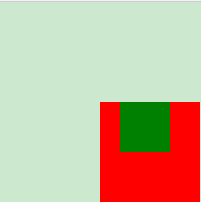
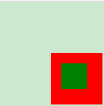
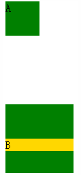
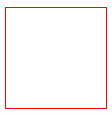

[TOC]

##### 1.介绍一下标准的CSS的盒子模型？低版本IE的盒子模型有什么不同的？

1.1分类：IE盒子模型和标准W3C盒子模型

1.2盒子模型：content、padding、border、margin

1.3区别（IE的content部分把 border 和 padding计算了进去）
###### W3C的标准Box Model:

###### 外盒尺寸计算：

Element空间高度 = content height + padding + border + margin   

Element 空间宽度 = content width + padding + border + margin   

###### 内盒尺寸计算：

 Element Height = content height + padding + border

 Element Width = content width + padding + border

###### 传统下Box Model

###### 外盒尺寸计算：

Element空间高度 = content Height + margin

Element空间宽度 = content Width + margin

###### 内盒尺寸计算：

 Element Height = content Height(Height包含了元素内容宽度，边框宽度，内距宽度)   

 Element Width = content Width(Width包含了元素内容宽度、边框宽度、内距宽度)
##### 2.CSS选择符有哪些？

###### 2.1 通配符选择器

*

###### 2.2 id选择器

(# idName)

###### 2.3 类选择器

(.className)类名中**包含**className即应用样式--多类选择器

###### 2.4 属性选择器

(a[attribute = attributeName])

**简单属性值选择**

有calss属性(值不限)的所有h1元素：**h1[class]**；

包含title属性的所有元素：**\*[title]**

同时包含href和title属性的HTML超链接元素：**a[href][title]**

**具体属性值选择**

class属性值是（**完全匹配，不是包含**）urgent warning的planet元素：**planet[class = "urgent warning"]**
**注意和类选择器的区别**

**部分属性值选择**

--其实就是词之间用空格分隔，可以根据其中任意一个词来进行选择，就和类选择器的用法类似

**p[class~="warning"]** 和p.warning是一致的，但是~可以用于所有所有属性，不止class属性

**css3新增--子串匹配属性选择器(3个)**

**[attribute^="value"]**

eg:a[src^="https"] 选择其 src 属性值以 "https" 开头的每个 a 元素。

**[attribute$="value"]**

eg:a[src$=".pdf"] 选择其 src 属性以 ".pdf" 结尾的所有a元素

**[attribute*="value"]**

eg:a[src*="abc"] 选择其 src 属性中包含 "abc" 子串的每个 a 元素。

[class*="col-"]类名中包含col-子串的元素

**特定属性选择类型**

**[attribute|="value"]**

eg：| 只匹配连字符分割的属性，比如*[lang|=en] 匹配 lang属性等于en或者以en-开头的所有元素

###### 2.5 标签选择器

div, h1, p等

###### 2.6 后代选择器

li a

###### 2.7 子选择器

ul > li

不想选择一个任意的后代元素，希望缩小范围，只选择另一个元素的子元素

###### 2.8 相邻选择器

h1 + p

选择紧接在一个h1元素后出现的所有段落，h1要和p元素有共同的父元素

###### 2.9 伪类选择器

a:link,a:visited,a:hover,a:active

p:first-letter,p:first-line,p:first-child

p:before,p:after

**css3新增的伪类选择器**

http://blog.csdn.net/github_34514750/article/details/51122212

eg:p:only-child 选择属于其父元素的唯一子元素的每个 <p> 元素。
##### 3.css哪些属性可以继承？哪些不可继承？


**css属性分类**

**字体属性：**

font-family,font-size,font-style,font-variant,font-weight,font可继承

**ps：** font-size继承的是计算后的实际值

**文本属性：**

word-spacing letter-spacing text-align text-transform text-indent line-height可以继承

text-decoration vertical-align不可继承

**颜色背景属性：**

color可以继承

background(background-color background-image background-repeat background-attachment background-position)不可继承

**边框属性：**

border(border-top border-right border-bottom border-left)(border-width border-style border-color)不可以继承

**定位和布局属性：**

margin padding width height float clear position left top overflow z-index display不可以继承

**列表属性：**

list-style-image, list-style-position,list-style-type, list-style可以继承

##### 4.伪类和伪元素的差别？
1. 伪类是通过给子元素添加一个类，然后定义这个类的样式来实现效果

    eg:  :link :visited :hover :active :focus :first-child

   伪元素是通过添加一个实际的元素，在给元素添加样式来实现效果的。

   eg:  :first-letter :first-line :before :after

       <style>
            p>i:first-child {color: red}
       </style>
       <p>
        <i>first</i>
        <i>second</i>
       </p>
       伪类实现其实是
       <style>
       .first-child {color: red}
       </style>
       <p>
            <i class="first-child">first</i>
            <i>second</i>
       </p>
       http://segmentfault.com/img/bVcccn

        <style>
            p:first-letter {color: red}
       </style>
       <p>I am stephen lee.</p>

       伪元素实现其实是

       <style>
            .first-letter {color: red}
        </style>
        <p><span class='first-letter'>I</span> am stephen lee.</p>


 2.css3中为了区分二者：伪类用: 但是伪元素用::

 但因为兼容性的问题，所以现在大部分还是统一的单冒号，但是抛开兼容性的问题，我们在书写时应该尽可能养成好习惯，区分两者。

##### 5.CSS优先级算法如何计算？

**1.css优先级**

是由四个级别和各个级别出现的次数决定的，值从左到右，左面的最大，一级大于一级

**2.优先级算法**

每个规则对应一个初始四位数：0,0,0,0

若是行内样式优先级，则是1,0,0,0，高于外部定义

    <div style=”color: red”>sjweb</div>

若是ID选择符，则分别加0,1,0,0

若是类选择符，属性选择符，伪类选择符，则分别加0,0,1,0

若是元素选择器，伪类选择器，则分别加0,0,0,1

**3.需要注意**

!important的优先级是最高的，但出现冲突时则需比较”四位数“

优先级相同时，则采用就近原则

继承得来的属性，其优先级最低

**4.实例**

body div p{color: green;}--Specificity值为0,0,0,3

Div # sjweb { font-size:12px;}--Specificity值为 0,1,0,1

html > body div [id=”totals”] ul li > p {color:red;}--Specificity值为 0,0,1,6

##### 6.CSS3新增伪类有那些？

http://blog.csdn.net/github_34514750/article/details/51122212

##### 7.如何居中div？如何居中一个浮动元素？如何让绝对定位的div居中？
居中div

    div{
        width:100px;
        height:100px;
        margin:0 auto;
    }

居中一个浮动元素：

    div{
        width:500px;
        height:300px;
        position:relative;
        top:50%;
        left:50%;
        margin:-150px 0 0 -250px;
    }


让绝对定位的div居中：

    div{

    }

##### 8.display有哪些值？说明他们的作用。

**block**

像块类型元素一样显示

**inline**

默认。此元素会被显示为内联元素，元素前后没有换行符。

**inline-block**

像行内元素一样显示，但其内容像块类型元素一样显示

内联块元素

（1）元素之间可以水平排列

（2）可以当做一个块级元素来设置各种的属性，例如：width、height、padding等。

**table**

此元素会作为块级表格来显示（类似 <table>），表格前后带有换行符。

**none**

缺省值。象行内元素类型一样显示。

**inherit**

规定应该从父元素继承 display 属性的值

##### 9.position的值relative和absolute定位原点是？
**static**

1.默认值，没有定位

2.元素出现在正常的流中

**relative**

1.生成相对定位的元素

2.元素在文档流中

3.相对于本来位置的顶部和左部进行定位

**absolute**

1.生成绝对定位的元素

2.元素脱离了文档流

3.位置是相对于position值不为static的第一个父元素进行定位，若没有这样一个祖先，则相对于原始的容器

**fixed**

1.生成绝对定位的元素

2.元素脱离了文档流

3.相对于浏览器窗口进行定位

**inherit**

规定从父元素继承position属性的值

##### 10.CSS3有哪些新特性？

**1.增加了border-raduis特性**

**2.新增了选择器和伪类**

新增的选择器：

[attribute^="value"]匹配字串的开头

[attribute$="value"]匹配字串的结尾

[attribute*="value"]匹配字串

新增的伪类：

:only-child/:nth-child()/:nth-last-child()/:last-child

:nth-of-type()/:nth-last-of-child()/:first-of-type/:only-of-type/:last-of-type

:root/:empty

http://blog.csdn.net/github_34514750/article/details/51122212


**3.新增了很多动画效果**

perspective

translate-style

translate:scale/skew/translate/rotate

animate

transition

gradient线性渐变

**4.文字特效**

文字特效      （text-shadow、）
文字渲染      （Text-decoration）

**5.阴影和反射**

阴影和反射        （Shadow\Reflect）

**6.多列布局**

多列布局        （multi-column layout）

##### 11.请解释一下CSS3的Flexbox（弹性盒布局模型）,以及适用场景？
见css布局中的flex布局
##### 12.用纯CSS创建一个三角形的原理是什么？
基于盒子模型，不给content的宽高，设置border，将上、左、右三条边隐藏掉

    {
        width:0;
        height:0;
        border-width:20px;
        border-style:solid;
        border-color:transparent transparent red transparent;
    }
##### 13.一个满屏 品 字布局 如何设计?
1.上边一个div，下边两个div

2.上边一个div高：50%，宽100%

3.下边两个div，高：50%，宽50%，一个是float:left;一个float:right;
或者是设置下边两个div的display:inline-block;注意不能用inline因为这样是行内元素，宽高设置会无效


    <!DOCTYPE html>
    <html>
        <head>
            <meta charset="utf-8">
            <link href="index.css" rel="stylesheet"
            <style>
                *{
                    margin: 0;
                    padding: 0;
                }
                html,body{
                    height: 100%;
                }
                .top{
                    width: 100%;
                    height: 50%;
                    border: 1px solid black;
                }
                .bottom{
                    width: calc(50% - 2px);
                    height: 50%;
                    border: 1px solid black;

                }
                .bottom1{
                    float: left;
                }
                .bottom2{
                    float: right;
                }
            </style>
        </head>

        <body>
            <div class="top"></div>
            <div class="bottom bottom1"></div>
            <div class="bottom bottom2"></div>
        </body>
    </html>


    <!DOCTYPE html>
    <html>
        <head>
            <meta charset="utf-8">
            <link href="index.css" rel="stylesheet">
            <style>
                *{
                    margin: 0;
                    padding: 0;
                }
                html,body{
                    height: 100%;
                }
                .top{
                    width: 100%;
                    height: 50%;
                    border: 1px solid black;
                }
                .bottom{
                    width: calc(50% - 4px);
                    height: 50%;
                    border: 1px solid black;
                    display: inline-block;
                }
            </style>
        </head>

        <body>
            <div class="top"></div>
            <div class="bottom bottom1">2</div>
            <div class="bottom bottom2">3</div>
        </body>
    </html>


##### 14.经常遇到的浏览器的兼容性有哪些？原因，解决方法是什么，常用hack的技巧 ？

1.浏览器默认的margin和padding不同，解决方法是使用如下代码统一

    *{
        margin:0;
        padding:0;
    }

2.

##### 15.li与li之间有看不见的空白间隔是什么原因引起的？有什么解决办法？

##### 16.为什么要初始化CSS样式?

1.浏览器的兼容性问题，不同浏览器对有些标签的默认值不同，若不对css初始化可能会导致浏览器之间的页面显示差异

2.初始化页面会比较方便，简化代码

3.初始化代码

    *{
        margin:0;
        padding:0;
    }

上述初始化虽然简单，但是其实很不推荐，如果网站很大，css样式表文件很多，他会把所有的标签都初始化一遍，这样就大大的加强了网站运行的负载，会使网站加载的时候需要很长一段时间。

腾讯QQ官网(http://www.qq.com)样式初始化

    body,ol,ul,h1,h2,h3,h4,h5,h6,p,th,td,dl,dd,form,fieldset,legend,input,textarea,select{margin:0;padding:0}
    body{font:12px"宋体","Arial Narrow",HELVETICA;background:#fff;-webkit-text-size-adjust:100%;}
    a{color:#2d374b;text-decoration:none}
    a:hover{color:#cd0200;text-decoration:underline}
    em{font-style:normal}
    li{list-style:none}
    img{border:0;vertical-align:middle}
    table{border-collapse:collapse;border-spacing:0}
    p{word-wrap:break-word}

##### 17.absolute的containing block计算方式跟正常流有什么不同？

**正常流的包含块：**

包含块由最近的块级祖先框，表单元格或行内块祖先框的内容边界构成。

**浮动元素的包含块：**

最近的块级祖先元素，浮动元素尽管是行内元素也会生成一个块级框

**定位的包含块**

根元素：

用户代理（比如浏览器）选择根元素（有的浏览器是html，有的是body）作为 containing block

非根元素：

1.position是relative或者static，包含块是最近的块级祖先框，表单元格或行内块祖先框的内容边界构成。

2.position是absolute，包含块由最近的position值不是static的块元素。

  如果祖先是块级元素，containing block 由祖先的 padding edge 形成。

  如果祖先是内联元素，containing block 取决于祖先的 direction 属性。

  1.如果 direction 是 ltr（左到右），祖先产生的第一个盒子的上、左内容边界是 containing block 的上方和左方，祖先的最后一个盒子的下、右内容边界是 containing block 的下方和右方。

  2.如果 direction 是 rtl（右到左），祖先产生的第一个盒子的上、右内容边界是 containing block 的上方和右方，祖先的最后一个盒子的下、左内容边界是 containing block 的下方和左方。

  如果没有祖先，根元素盒子的内容边界确定为 containing block。

3.position是fixed，包含块是视窗本身

##### 18.CSS里的visibility属性有个collapse属性值是干嘛用的？在不同浏览器下以后什么区别？

    visibility:hidden/visible/inherit/collapse

visibility:collapse 当在表格中使用的时候，此值可以删除一行或者一列。值被应用于其他元素时，则呈现为hidden

**html代码：**

    <table cellspacing="0" class="table">
        <tr>
            <th>Fruits</th>
            <th>Vegetables</th>
            <th>Rocks</th>
        </tr>
        <tr>
            <td>Apple</td>
            <td>Celery</td>
            <td>Granite</td>
        </tr>
        <tr>
            <td>Orange</td>
            <td>Cabbage</td>
            <td>Flint</td>
        </tr>
    </table>

    <p><button>collapse行1</button></p>

    <p><button>hide行1</button></p>

    <p><button>重置</button></p>

**css代码：**

    body {
      text-align: center;
      padding-top: 20px;
      font-family: Arial, sans-serif;
    }

    table {
      border-collapse: separate;
      border-spacing: 5px;
      border: solid 1px black;
      width: 500px;
      margin: 0 auto;
    }

    th, td {
      text-align: center;
      border: solid 1px black;
      padding: 10px;
    }

    .vc {
      visibility: collapse;
    }

    .vh {
      visibility: hidden;
    }

    button {
      margin-top: 5px;
    }

**js代码：**

    var btns = document.getElementsByTagName('button'),
    rows = document.getElementsByTagName('tr');

    btns[0].addEventListener('click', function () {
    rows[1].className = 'vc';
    }, false);

    btns[1].addEventListener('click', function () {
    rows[1].className = 'vh';
    }, false);

    btns[2].addEventListener('click', function () {
    rows[1].className = '';
    }, false);

http://www.webhek.com/visibility-collapse

##### 19.position跟display、margin collapse、overflow、float这些特性相互叠加后会怎么样？

display的转换对应表

| 设定值  | 计算值  |
| :------------ |:---------------:|
|inline-table |table |
|inline, run-in, table-row-group, table-column, table-column-group, table-header-group, table-footer-group, table-row, table-cell, table-caption, inline-block|block|
|其他|同设定值|

**position，float，display的关系和优先级**

**1.display值是none**

如果display是none，则position和float不起作用。因为元素不产生框，因此浮动和定位无效。若display不是none，则继续

**2. 'position' 的值是 'absolute' 或 'fixed' **

框是相对定位的，计算后的float应该是none。并且display按照上表设置。框的位置将由 'top'，'right'，'bottom' 和 'left' 属性和该框的包含块确定。

也就是说，当元素是绝对定位时，浮动失效，'display' 会被按规则重置。
若position不是absolute或fixed，则继续

**3.float的值不是none**

如果float值不是none，则该框浮动并且display按照转换对应表设置，若float是none

**4.元素是根元素**

如果元素是根元素，display值按照对应表设置，否则，按照5

**5.应用指定的display特性值**

**margin collapse外边距折叠**

**1.多个相邻（兄弟或者父子关系）普通流的块元素垂直方向marigin会重叠**

**折叠的结果：**

两个相邻的外边距都是正数时，折叠结果是它们两者之间较大的值。

两个相邻的外边距都是负数时，折叠结果是两者绝对值的较大值。

两个外边距一正一负时，折叠结果是两者的相加的和。

**折叠的产生情况：**

1.必须是处于常规文档流（非float和绝对定位）的块级盒子,并且处于同一个BFC当中。

2.没有线盒，没有空隙（clearance，下面会讲到），没有padding和border将他们分隔开(ps
    :所以解决办法中有padding或者border两种办法)

3.都属于垂直方向上相邻的外边距，可以是下面任意一种情况  

元素的margin-top与其第一个常规文档流的子元素的margin-top

元素的margin-bottom与其下一个常规文档流的兄弟元素的margin-top

height为auto的元素的margin-bottom与其最后一个常规文档流的子元素的margin-bottom

高度为0并且最小高度也为0，不包含常规文档流的子元素，并且自身没有建立新的BFC的元素的margin-top和margin-bottom


**块元素是同级关系**

margin-bottom和margin-top取较大值
```
<div id="div1"></div>
<div id="div3"></div>

/*如下，margin合并了是200px*/
#div1{
    width: 100px;
    height: 100px;
    margin: 100px 0 0 100px;
    margin-bottom:200px;
    background: red;

}
#div3{
    margin-top:160px;
    width: 50px;
    height: 50px;
    background: green;
}
```


**块元素是父子关系**

marigin-top会取较大值

```
<div id="div1">
    <div id="div2"></div>
</div>

/*如下，margin-top是100px，若div2的margin-top为120px，则是120px，永远选较大的。两者上部贴合*/
#div1{
    width: 100px;
    height: 100px;
    margin: 100px 0 0 100px;
    margin-bottom:200px;
    background: red;
}
#div2{
    width: 50px;
    height: 50px;
    margin-top: 20px;
    margin-left: 20px;
    background: green;
}
```


**解决父子DIV顶部外边距折叠办法：**

1.给父元素div设置边框

```
#div1{
    width: 100px;
    height: 100px;
    margin: 100px 0 0 100px;
    margin-bottom:200px;
    background: red;
    border:1px solid transparent;
}
#div2{
    width: 50px;
    height: 50px;
    margin-top: 20px;
    margin-left: 20px;
    background: green;
}
```


2.给父元素div设置padding

```
#div1{
    width: 100px;
    height: 100px;
    margin: 100px 0 0 100px;
    margin-bottom:200px;
    background: red;
    padding:1px;
}
#div2{
    width: 50px;
    height: 50px;
    margin-top: 20px;
    margin-left: 20px;
    background: green;
}
```


3.给父元素div设置overflow--其实是生成了一个新的BFC

```
#div1{
    width: 100px;
    height: 100px;
    margin: 100px 0 0 100px;
    margin-bottom:200px;
    background: red;
    overflow:hidden;
}
#div2{
    width: 50px;
    height: 50px;
    margin-top: 20px;
    margin-left: 20px;
    background: green;
}
```


**2.绝对定位元素，float元素，inline-box元素，overflow : hidden不会和垂直方向上的其他元素margin折叠--其实就是可以生成新的BFC**

```
<div style="margin-bottom:50px;width:50px; height:50px; background-color:green;">A</div>
<div style="margin-top:50px; width:100px; height:100px; background-color:green; float:left;">
    <div style="margin-top:50px;background-color:gold;">B</div>
</div>
```


两个绿色的块儿之间，相距100px，而若 B 和它的浮动包含块发生 margin 折叠的话，金色的条应该位于绿色块的最上方，显然，没有发生折叠。inline-block 元素、绝对定位元素的 margin同样如此， 不会和垂直方向上其他元素的 margin 折叠。

**3.元素自身的 margin-bottom 和 margin-top 相邻时也会折叠 **

自身 margin-bottom 和 margin-top 相邻，只能是自身内容为空，垂直方向上 border、padding 为 0。

```
<div style="border:1px solid red; width:100px;">
    <div style="margin-top: 100px;margin-bottom: 50px;></div>
</div>
```

以上代码运行后，我们讲得到的是红色边框的正方形，方框的宽高都应该是 100px，高度不应该是 150px。



**overflow和position**

css规范中规定此属性overflow：

如果后代元素的包含块是整个视窗或者是定义overflow元素的父元素，则不裁剪。其余溢出则可裁剪。---其实就是要想彻底剪裁它的所有子元素，它不但要有overflow:hidden，而且还要作为所有子元素的包含块。

前边我们说过绝对定位（position:absolute）的元素的包含块由最近的position值不是static的块元素。

因此若同时满足下列两个条件则不裁剪：

1.内部溢出的元素是通过position:absolute绝对定位

2.拥有overflow:hidden样式的块元素不具有position:relative相对 和position:absolute绝对定位。

##### 20.对BFC规范(块级格式化上下文：block formatting context)的理解？

它是一个独立容器，决定了元素如何对其内容进行定位,以及与其他元素的关系和相互作用。

一个页面是由很多个 Box 组成的,元素的类型和 display 属性,决定了这个 Box 的类型。

 不同类型的 Box,会参与不同的 Formatting Context（决定如何渲染文档的容器）,因此Box内的元素会以不同的方式渲染,也就是说BFC内部的元素和外部的元素不会互相影响。

http://blog.csdn.net/github_34514750/article/details/51364202

##### 21.CSS权重优先级是如何计算的？

以下是权重的规则：标签的权重为1，class的权重为10，id的权重为100，以下例子是演示各种定义的权重值：

    /*权重为1*/
    div{
    }
    /*权重为10*/
    .class1{
    }
    /*权重为100*/
    #id1{
    }
    /*权重为100+1=101*/
    #id1 div{
    }
    /*权重为10+1=11*/
    .class1 div{
    }
    /*权重为10+10+1=21*/
    .class1 .class2 div{
    }

如果权重相同，则最后定义的样式会起作用，但是应该避免这种情况出现


##### 22.请解释一下为什么会出现浮动和什么时候需要清除浮动？清除浮动的方式和优劣。

**出现浮动的原因：**

为了方便布局，出现了浮动元素，可以方便的让元素移动。但是浮动元素也就脱离了正常流，正是因为这种特性

**需要清除浮动的情况：**

1.浮动框高度超出包含框的时候，也就会出现包含框不会 自动伸高来闭合浮动元素（“高度塌陷”现象）。

2.导致本属于普通流中的元素浮动之后，包含框内部由于不存在其他普通流元素了，也就表现出高度为0（高度塌陷）

**清除浮动的方法，也要注意推荐使用的方法：**

**1.父级div定义height**
```
<div class="div1">
    <div class="left">Left</div>
    <div class="right">Right</div>
</div>
<style>
   .div1{background:#000080;border:1px solid red;/*解决代码*/height:200px;}

   .left{float:left;width:20%;height:200px;background:#DDD}
   .right{float:right;width:30%;height:80px;background:#DDD}
</style>

```
•原理：父级div手动定义height，就解决了父级div无法自动获取到高度的问题

•优点：简单，代码少，容易掌握

•缺点：只适合高度固定的布局，要给出精确的高度，如果高度和父级div不一样时，会产生问题

•建议：不推荐使用，只建议高度固定的布局时使用

**2.结尾处加空div标签clear:both**

```
<div class="div1">
    <div class="left">Left</div>
    <div class="right">Right</div>
    <div class="clearfloat"></div>
</div>
<style>
   .div1{background:#000080;border:1px solid red;}

   .left{float:left;width:20%;height:200px;background:#DDD}
   .right{float:right;width:30%;height:80px;background:#DDD}
   /*解决代码*/
   .clearfloat{
       clear:both;
   }
</style>
```

•原理：添加一个空div，利用css提高的clear:both清除浮动，让父级div能自动获取到高度

•优点：简单，代码少，浏览器支持好，不容易出现怪问题

•缺点：不少初学者不理解原理；如果页面浮动布局多，就要增加很多空div，让人感觉很不爽

•建议：不推荐使用，但此方法是以前主要使用的一种清除浮动方法

**3.结尾处加br标签clear:both**

```
<div class="div1">
    <div class="left">Left</div>
    <div class="right">Right</div>
    <br class="clearfloat"/>
</div>
<style>
   .div1{background:#000080;border:1px solid red;}

   .left{float:left;width:20%;height:200px;background:#DDD}
   .right{float:right;width:30%;height:80px;background:#DDD}
   /*解决代码*/
   .clearfloat{
       clear:both;
   }
</style>
```

原理：父级div定义zoom:1来解决IE浮动问题，结尾处加br标签clear:both。

建议：不推荐使用，只作了解。

**4.父级div定义伪类:after和zoom**--这个是最推荐的，优雅的demo，四颗星

```
<div class="div1 clearfloat">
    <div class="left">Left</div>
    <div class="right">Right</div>
</div>
<style>
   .div1{background:#000080;border:1px solid red;}

   .left{float:left;width:20%;height:200px;background:#DDD}
   .right{float:right;width:30%;height:80px;background:#DDD}
   /*解决代码*/
   .clearfloat:after{
       content: "";
       display: block;
       clear: both;
   }
   .clearfloat{
       zoom:1;
   }
</style>
```
原理：IE8以上和非IE浏览器才支持:after，原理和方法2，3有点类似，zoom(IE转有属性)可解决ie6,ie7浮动问题。

优点：浏览器支持好，不容易出现怪问题（目前：大型网站都有使用，如：腾迅，网易，新浪等等）。

缺点：代码多，不少初学者不理解原理，要两句代码结合使用，才能让主流浏览器都支持。

建议：推荐使用，建议定义公共类比如这的clearfloat，以减少CSS代码。

**5.父级div定义overflow:hidden**--三颗星

**overflow和position**

css规范中规定此属性overflow：

如果后代元素的包含块是整个视窗或者是定义overflow元素的父元素，则不裁剪。其余溢出则可裁剪。---其实就是要想彻底剪裁它的所有子元素，它不但要有overflow:hidden，而且还要作为所有子元素的包含块。

前边我们说过绝对定位（position:absolute）的元素的包含块由最近的position值不是static的块元素。

因此若同时满足下列两个条件则不裁剪：

1.内部溢出的元素是通过position:absolute绝对定位

2.拥有overflow:hidden样式的块元素不具有position:relative相对 和position:absolute绝对定位。

```
<div class="div1 clearfloat">
    <div class="left">Left</div>
    <div class="right">Right</div>
</div>
<style>
   .div1{background:#000080;border:1px solid red;/*解决代码*/overflow: hidden;}

   .left{float:left;width:20%;height:200px;background:#DDD}
   .right{float:right;width:30%;height:80px;background:#DDD}

</style>
```

原理：必须定义width或zoom:1，同时不能定义height，使用overflow:hidden时，浏览器会自动检查浮动区域的高度。

优点：简单，代码少，浏览器支持好。

缺点：不能和position配合使用，因为超出的尺寸的会被隐藏。

建议：只推荐没有使用position或对overflow:hidden理解比较深的朋友使用。

**6.父级div定义overflow:auto**--两颗星

```
<div class="div1 clearfloat">
    <div class="left">Left</div>
    <div class="right">Right</div>
</div>
<style>
   .div1{background:#000080;border:1px solid red;/*解决代码*/overflow: auto;}

   .left{float:left;width:20%;height:200px;background:#DDD}
   .right{float:right;width:30%;height:80px;background:#DDD}

</style>
```

原理：必须定义width或zoom:1，同时不能定义height，使用overflow:auto时，浏览器会自动检查浮动区域的高度。

优点：简单，代码少，浏览器支持好。

缺点：内部宽高超过父级div时，会出现滚动条。

建议：不推荐使用，如果你需要出现滚动条或者确保你的代码不会出现滚动条就使用吧。


##### 23.移动端的布局用过媒体查询吗？

##### 24.使用 CSS 预处理器吗？喜欢那个？

##### 25.CSS优化、提高性能的方法有哪些？
1.尽量将样式写在单独的css文件中，在head元素中引入<link>

好处：
(1)内容和样式分离，容易管理和维护
(2)减少页面体积
(3)css文件可以被缓存、重用，维护成本降低

2.避免使用@import

```
<link rel='stylesheet' href='a.css'>

<style>
@import url('a.css');
</style>
```
(1)link是html标签，除了加载css还可以定义rss等其他事物；@import属于css范畴，只可以加载css
(2)link引入css，是页面载入同时加载；但是import则是页面完全载入后才加载，所以会延长页面下载时间
(3)link是html标签，没有兼容问题；但是import则有此问题
(4)link支持js控制dom改变样式，但是@import不支持

3.精简css，减少css代码量。

（1）定义简洁的css规则

合并相关规则，定义简洁的属性值

合并规则是指比如font-family、font-size、font-weight等等，可以合并为font。 简洁属性值，比如颜色值：color，#33AAFF可以简化为#3AF等。

（2）合并相同定义

网页中总会有一些模块有较高相似度，则可把同样的部分共用一次定义，不同的部分再单独定义。而且在css中，很多属性是可以继承的，则只需要在合适的地方定义一次即可。

（3）删除无效的定义

无效的定义，并不会影响页面功能显示，但会影响页面展示的性能，增加代码量的同时，也增加了浏览器解析代码的时间。无效的定义包括无效的规则及无效的样式属性，一般是开发过程中引入的，而从直观上无法判断，这情况，可以用工具，chrome自带的工具就可以查找css中的无效样式。

（4）充分利用css继承减少代码量

我们知道有一部分CSS代码是可以继承的，如果父元素已经设置了该样式，子元素就不需要去设置该样式，这个也是提高性能的行之有效的方法。可回头看下总结的可以继承的样式

4.使用高效的选择器--可以匹配更快，查找次数较少

选择器查找的原理：
举个例子：.nav ul.list li div{}

它不是从第一个.nav开始去慢慢的缩小范围，而是从div这个“裸奔”的盒子开始，相当于遍历，然后再找到li，以此类推.

所以我们定义选择器时，应该让第一次匹配时的数量达到最少，并且让整体的匹配查找次数最少。
（1）避免使用通配符

（2）避免使用标签选择器和单个属性选择器作为关键选择器

（3）不要在id选择器前加标签名

（4）尽量不要在选择符定义过多层级，层级越少，同时也降低了css和dom结构的耦合程度，提高样式的可维护性

5.css相关的图片处理

（1）不给图片设置尺寸

在我个人的从业经历当中，有过这样的情况，我按照设计稿做好了页面，交给后台去测试，他就突然跑过来跟我说：hi，你看，这儿出状况了，我一看，坏菜，图片出格了，我才想起没有给图片定义宽高（直接从设计稿里切的也不需要），然后就犯错了似的在css样式里定义了宽高。以至于后来我把这个作为下次再做页面时候的注意事项。当我看到这一条意见的时候，才更知一二。

来看解释，第一、设计人员为了画面的精美，会制作一些超出需求尺寸的图片；第二、同一张图片可能会在页面不同地方多次使用，比如缩略图、正常图、大图。问题来了，如果图片原始尺寸和实际需求不同，在使用过程中就会存在性能问题，利用样式缩放会带来cpu的额外计算过程，增加了图片在浏览器的渲染时间，网络传输过程也会占更多带宽，增加下载时间。因此，最佳做法是，为需要的部分单独做一套图片，初始页面加载时就能更快展示。

（2）使用css“雪碧图“

是将零散的图片合并成一张大图，在利用css进行背景定位。好处是减少请求数，提高了图片整体的加载速度。

但它也存在一些缺点：

比如，多张图片合并成大图，需要精确计算，仔细的调整位置，单纯手工制作是一件很复杂的事情。（所幸现在有一些工具可以帮我们做）

另外，维护过程复杂，要尽量让已有的图片保持原来的位置不变，如果是背景图的尺寸发生变化导致原有区域无法放置，那就只好放弃，如果非要在原有位置修改，则剩余的图片样式都需要修改，是很繁琐的过程。新加的图片最好放在最后面。

```
#zishu .info .tool .sidebar h2{ font-size:12px;}这是非常不推荐的，
推荐写法：.zishu-s-h2{font-size:12px;}。
```

5.可以使用css lint写css，从而提高性能

##### 26.浏览器是怎样解析CSS选择器的？

是从右往左匹配的，因为一个父元素有很多子元素，但是一个子元素只有一个父元素，平均下来时间是较从左向右短。

但是有时候从右往左也是有弯路的，比如上述例子：

选择器查找的原理：
举个例子：.nav ul.list li div{}

它不是从第一个.nav开始去慢慢的缩小范围，而是从div这个“裸奔”的盒子开始，相当于遍历，然后再找到li，以此类推.

##### 27.在网页中的应该使用奇数还是偶数的字体？为什么呢？

##### 28.margin和padding分别适合什么场景使用？

1.两者都可以用来隔开元素
  margin布局元素使元素与元素互不相干
  padding用于元素与内容之间的间隔

2.什么时候用margin，什么时候用padding

  何时应当使用margin：

  （1）需要在border外侧添加空白时，

  （2）空白处不需要有背景（色）时，

  （3）上下相连的两个盒子之间的空白需要相互抵消时，比如15px+20px的margin，将得到20px的空白（注意地方见第三点）。

  何时应当使用padding

  （1）需要在border内侧添加空白时（往往是文字与边框距离的设置），

  （2）空白处需要背景（色）时，

  （3）上下相连的两个盒子之间的空白希望等于两者之和时，比如15px+20px的padding，将得到35px的空白。

##### 29.抽离样式模块怎么写，说出思路，有无实践经验？[阿里航旅的面试题]

##### 30.元素竖向的百分比设定是相对于容器的高度吗？

##### 31.全屏滚动的原理是什么？用到了CSS的那些属性？

##### 32.什么是响应式设计？响应式设计的基本原理是什么？如何兼容低版本的IE？

##### 33.视差滚动效果，如何给每页做不同的动画？（回到顶部，向下滑动要再次出现，和只出现一次分别怎么做？）

##### 32.::before 和 :after中双冒号和单冒号 有什么区别？解释一下这2个伪元素的作用。

##### 33.如何修改chrome记住密码后自动填充表单的黄色背景 ？

**问题的出现：**
chrome的表单在自动填充后，input文本框的背景会变成黄色，通过审查元素后发现chrome默认自动填充的input表单加上input:-webkit-autofill私有属性

```
input:-webkit-autofill, textarea:-webkit-autofill, select:-webkit-autofill {
  background-color: rgb(250, 255, 189);
  background-image: none;
  color: rgb(0, 0, 0);
}
```
**问题的影响：**
在有些情况下，这个黄色的背景会影响到我们界面的效果，尤其是在我们给input文本框使用图片背景的时候，原来的圆角和边框都被覆盖了。

**解决办法：**
1.本来想修改上述默认属性，但是貌似不能覆盖默认樣式，但是可以用別的样式曲线达到目的。除了chrome默认定义的background-color，background-image，color不能用!important提升其优先级以外，其他的属性均可使用!important提升其优先级

2.可以对input:-webkit-autofill使用足够大的纯色内阴影来覆盖input输入框的黄色背景，但是这样就没有原来的内阴影了~
```
input : -webkit-autofill {
 -webkit-box-shadow : 0 0 0px 1000px white inset ;--可看css3中的知识点
 border : 1px solid #CCC !important ;
}

```

```
input : -webkit-autofill {
 -webkit-box-shadow : 0 0 0px 1000px white inset ;
 border : 1px solid #CCC !important ;
 height : 27px !important ;
 line-height : 27px !important ;
 border-radius : 0 4px 4px 0 ;
}
```

3.关闭表单自带的保存功能，自己重新写cookie存储
```
<form autocomplete="off" method=".." action="..">
```
##### 34.你对line-height是如何理解的？

##### 35.设置元素浮动后，该元素的display值是多少？（自动变成display:block）

display的转换对应表

| 设定值  | 计算值  |
| :------------ |:---------------:|
|inline-table |table |
|inline, run-in, table-row-group, table-column, table-column-group, table-header-group, table-footer-group, table-row, table-cell, table-caption, inline-block|block|
|其他|同设定值|

##### 36.怎么让Chrome支持小于12px 的文字？

```
html{-webkit-text-size-adjust: none;}
```
##### 37.让页面里的字体变清晰，变细用CSS怎么做？（-webkit-font-smoothing: antialiased;）
font-smoothing是非标准的CSS定义。

Webkit在自己的引擎中支持了这一效果。

-webkit-font-smoothing

它有三个属性值：

none ------ 对低像素的文本比较好

subpixel-antialiased------默认值

antialiased ------抗锯齿很好

##### 38.font-style属性可以让它赋值为“oblique” oblique是什么意思？

font-style：normal/italic/oblique/inherit;

italic会显示一个斜体的字体样式。

oblique会显示一个倾斜的字体样式。一些不常用的字体没有italic，这时候需要用oblique来实现文字的倾斜。

##### 39.position:fixed;在android下无效怎么处理？

##### 40.如果需要手动写动画，你认为最小时间间隔是多久，为什么？（阿里）

找个要根据显示器的频率来决定，现在大多数显示器的默认频率是60HZ，也就是1s刷新60次，所以最小间隔是1/60s，也就是16.7ms

##### 41.display:inline-block 什么时候会显示间隙？(携程)

移除空格、使用margin负值、使用font-size:0、letter-spacing、word-spacing

##### 42.overflow: scroll时不能平滑滚动的问题怎么处理？

##### 43.有一个高度自适应的div，里面有两个div，一个高度100px，希望另一个填满剩下的高度。

##### 44.png、jpg、gif 这些图片格式解释一下，分别什么时候用。有没有了解过webp？

##### 45.什么是Cookie 隔离？（或者说：请求资源的时候不要让它带cookie怎么做）
如果静态文件都放在主域名下，那静态文件请求的时候都带有的cookie的数据提交给server的，非常浪费流量，
所以不如隔离开。

因为cookie有域的限制，因此不能跨域提交请求，故使用非主要域名的时候，请求头中就不会带有cookie数据，
这样可以降低请求头的大小，降低请求时间，从而达到降低整体请求延时的目的。

同时这种方式不会将cookie传入Web Server，也减少了Web Server对cookie的处理分析环节，
提高了webserver的http请求的解析速度。

##### 46.style标签写在body后与body前有什么区别？

##### 47.什么是CSS 预处理器 / 后处理器？

预处理器例如：LESS、Sass、Stylus，用来预编译Sass或less，增强了css代码的复用性，
 还有层级、mixin、变量、循环、函数等，具有很方便的UI组件模块化开发能力，极大的提高工作效率。

后处理器例如：PostCSS，通常被视为在完成的样式表中根据CSS规范处理CSS，让其更有效；目前最常做的
 是给CSS属性添加浏览器私有前缀，实现跨浏览器兼容性的问题。

##### 48.水平垂直居中
###### 1. 盒子模型
margin外边距，border边框，padding内边距，element元素
###### 2. 水平布局
####### 2.1 盒子模型理解水平布局
  父元素width=子元素margin-left+border-left+padding-left+width+padding-right+border-right+margin-right;
####### 2.2 行内元素实现水平居中

```
h1等p等可以直接用，但是span在div中居中，需要加上dispaly:block;再查下资料为什么
text-align="center";
```
####### 2.3 使用width和margin水平居中
```
{
	width:100px;
	margin-left:auto;
	margin-right:auto;
}
```
####### 2.4 使用position，margin和left水平居中

```
eg1:实现在父元素水平居中
.box {
	height: 100px;
	width: 100px;
	position: absolute;
	margin: 0px 0 0 -50px;//宽度的一半
	left: 50%;
}
```

```
eg2:实现在父元素水平居中
.box {
	height: 100px;
	width: 70%;
	position: absolute;
	margin: 0px 0 0 -35%;//宽度的一半
	left: 50%;
}
```
####### 2.5 使用incline-block水平居中
仅inline-block属性是无法让元素水平居中，display:incline-block;
 关键之处要在元素的父容器中设置text-align的属性为“center”，这样才能达到效果
####### 2.6 浮动实现水平居中的方法：

```
<ul>
	<li></li>
	<li></li>
	<li></li>
	<li></li>
</ul>
ul{
	float:left;
	position:relative;
	left:50%;//整个分页向右边移动宽度的50%
}
li{
	float:left;//我们会让导航浮动到左边，而且每个分页项也进行浮动，
	position:relative;
	right:50%;//将每个分页项向左边移动宽度的50%
}
```
####### 2.7 图片在div中居中方法：

```
查下align这个属性
<div align="center">
    
</div>
```
####3. 垂直布局和垂直居中对齐
#####3.1 盒子模型理解垂直布局
父元素height=子元素margin-top+border-top+padding-top+height+padding-bottom+border-bottom+margin-bottom
#####3.2 单行文字
若单行文字居中，让line-height设置与外部盒子的height值一样即可。
#####3.3 水平和垂直的居中

```
eg3:实现在浏览器框中的水平和垂直的居中
#container{
	position: fixed;
	width: 400px;
	height: 200px;
	background: #ccc;
	margin: -100px 0 0 -200px;
	left: 50%;
	top:50%;
}
```

```
eg4:实现对父元素的水平和垂直的居中
.is-Negative {
	width: 300px;
	height: 200px;
	padding: 20px;
	position: absolute;
	top: 50%;
	left: 50%;
	margin-left: -170px; /* (width + padding)/2 */
	margin-top: -120px; /* (height + padding)/2 */
}
```
####4. 包含浮动
一个父元素包含了多个浮动的子元素。页面的内容设置了一个宽度，子元素的浮动确定了他们的位置，但浮动元素不会影响父元素的宽度。
 这样做会让父元素塌陷，从而使父元素的高度为“0”，以及忽略其他的属性。
```
<div class="box-set">
<div class="box">Box 1</div>
<div class="box">Box 2</div>
<div class="box">Box 3</div>
</div>
.box-set {
	background: #e8eae9;
}
.box {
	background: #8ec63f;
	height: 100px;
	float: left;
	margin: 10px;
	width: 200px;
}
```
这个父元素box-set会塌陷，不会出现background: #e8eae9;的效果；
####5. 清除浮动
#####5.1 父元素中加入overflow清除浮动，则不会出现塌陷，父元素效果可以呈现出来

```
.box-set {
    background: #404853;
    overflow: auto;
}
```
使用“overflow:auto;”,在IE中会给元素添加滚动条，最好是直接使用“overflow:hidden;”来清除浮动。
#####5.2 clearfix清除浮动
“clearfix”技巧是基于在父元素上使用“:before”和“:after”两个伪类。
 使用这些伪类，我们可以在浮动元素的父容器前面和后面创建隐藏元素。
    “:before”伪类是用来防止子元素顶部的外边距塌陷，使用“display: table”创建一个匿名的“table-cell”元素。
    “:after”伪类是用来防止子元素的底部的外边距塌陷，以及用来清除元素的浮动。
```
.box-set:before,
.box-set:after {
	content: "";
	display: table;
}
.box-set:after {
	clear: both;
}
.box-set {
	*zoom: 1;
}
```
####6. 定位
使用定位，可以准确的定义元素框相对于其正常位置应该出现在哪，或者相对于父元素，另一个元素甚至浏览器窗口本身的位置
#####6.1 position relative:
  relative”可以给元素设置位移（offset）“top、right、bottom和left”属性。通过这些位移属性设置可以给元素进行精确的定位。
#####6.2 position absolute:
  绝对定位元素会脱离文档流,绝对定位元素的位置直接和父容器是否设置了相对定位（绝对定位）有直接关系。
  绝对定位元素需要至少一个祖先元素设置了相对定位（绝对定位），不然元素定位会相对于页面的主体进行定位。
#####6.2 position fixer:
  固定定位和绝对定位很类似，但是他定位是相对于浏览器窗口，并且不会随滚动条进行滚动。
  固定定位最常见的一种用途就是在页面中创建一个固定头部、或者脚部、或者固定页面的一个侧面。不需使用margin、border和padding。
####7. z-index属性
改变元素是的层叠顺序，改变这种层叠顺序可以直接使用“z-index”来控制。元素的“z-index”值越高将会出现在越上面，不管元素在Dom哪个位置上。
